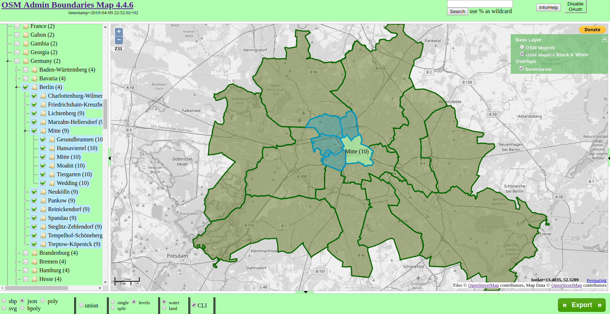
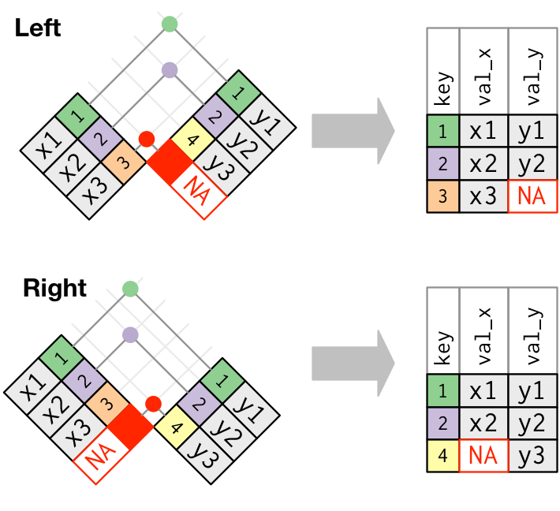

# Plotting with *ggplot2*

TODO

# Sources for geo-data

## R packages

The following packages come directly with geo-data or provide means to download them programmatically:

- [maps](https://cran.r-project.org/web/packages/maps/index.html): World, USA, US states, US counties and more
- [mapdata](https://cran.r-project.org/web/packages/mapdata/index.html): World in higher resolution, China, Japan and more
- [rnaturalearth](https://cran.r-project.org/web/packages/rnaturalearth/index.html): *R package to hold and facilitate interaction with natural earth vector map data.* &rarr; see next slides
- [OpenStreetMap](https://cran.r-project.org/web/packages/OpenStreetMap/): Access to the OpenStreetMap API &rarr; see next slides

## Natural Earth Data

[naturalearthdata.com](http://www.naturalearthdata.com/): *Natural Earth is a **public domain map dataset** available at 1:10m, 1:50m, and 1:110 million scales. Featuring tightly integrated vector and raster data, with Natural Earth you can make a variety of visually pleasing, well-crafted maps with cartography or GIS software.*

Provides vector data for:

- countries and provinces, departments, states, etc.
- populated places (capitals, major cities and towns)
- physical features such as lakes, rivers, etc.

You can either download the data directly from the website or use the package [rnaturalearth](https://cran.r-project.org/web/packages/rnaturalearth/index.html).

## Open Street Map

- provides even more detail than *Natural Earth Data*: streets, pathways, bus stops, metro lines, etc.
- [GeoFabrik](https://download.geofabrik.de/) provides downloads of the raw data
- is much harder to work with b/c of the complexity of the data

[OSM Admin Boundaries Map](https://wambachers-osm.website/boundaries/): web-service to download administrative boundaries worldwide for different levels in different formats (shapefile, GeoJSON, etc.); contains meta-data (depending on country) such as AGS in Germany

[This wiki article](https://wiki.openstreetmap.org/wiki/DE:Grenze#Gemeinden_.E2.80.93_admin_level.3D7.E2.80.938) explains which OpenStreetMap administrative boundary levels correspond to which regional level in Germany (e.g. level 6 corresponds to "Kreise").

## Administrative authorities in the EU

Administrative authorities often provide geo-data. In the EU, the main source is [eurostat](https://ec.europa.eu/eurostat) which provides data referenced by NUTS code.

- [main NUTS datasets as SHP, GeoJSON, TopoJSON, SVG](https://ec.europa.eu/eurostat/web/gisco/geodata/reference-data/administrative-units-statistical-units/nuts)
- [Nuts2json](https://github.com/eurostat/Nuts2json) provides another overview for GeoJSON and TopoJSON datasets
- [correspondence tables](https://ec.europa.eu/eurostat/web/nuts/correspondence-tables/postcodes-and-nuts) map national structures and postcodes to NUTS regions

## Administrative authorities in Germany

*Statistisches Bundesamt* provides [geo-referenced data](https://www.destatis.de/DE/Themen/Laender-Regionen/Regionales/_inhalt.html), such as:

- [Gemeindeverzeichnis](https://www.destatis.de/DE/Themen/Laender-Regionen/Regionales/Gemeindeverzeichnis/_inhalt.html): AGS, area, population, etc.
- [Regionaldatenbank](https://www.regionalstatistik.de/genesis/online): GDP, building land value, etc.
- [govdata.de](https://www.govdata.de/): Open data portal for Germany -- lots of data, but not very well curated and documented

Berlin:

- [Senate Department for Urban Development and Housing](http://www.stadtentwicklung.berlin.de/planen/basisdaten_stadtentwicklung/index.shtml) for example provides datasets based on [LOR units](http://www.stadtentwicklung.berlin.de/planen/basisdaten_stadtentwicklung/lor/index.shtml)
- [FIS Broker](https://fbinter.stadt-berlin.de/fb/index.jsp) is a web-service providing all publicly available geo-referenced data -- [this post](https://lab.technologiestiftung-berlin.de/projects/fisbroker-to-qgis/index.html) shows how to use it

## What about historical data?

Geographic areas such as administrative borders change. Identifiers may change, too. Make sure to use the version that matches your dataset!

- *Eurostat* provides historical NUTS areas back to 2003
- *Statistisches Bundesamt* also provides an archive

# Data linkage with *dplyr*

## Left and right (outer) joins

*Left and right outer joins* keep all observations on the left-hand or right-hand side data sets respectively. Unmatched rows are filled up with *NA*s:

Syntax: `inner_join(a, b, by = <criterion>)`

## Inner joins

An *inner join* matches keys that appear in both data sets and returns the combined observations:

Syntax: `inner_join(a, b, by = <criterion>)`

## Specifying matching criteria

Parameter `by` can be:

1. a character string specifying the key for both sides, e.g.: `inner_join(pm, city_coords, by = 'city')` will match `city` column in `pm` with `city` column in `city_coords`;
2. a vector of character strings specifying several keys to match both sides, e.g.: `inner_join(pm, city_coords, by = c('city', 'country')` will match those rows, where `city` *and* `country` columns match;
3. a *named* character string vector like `inner_join(pm, city_coords, by = c('cityname' = 'id')`, which will match the column `cityname` in `pm` with the column `id` in `city_coords`

## An example

TODO
