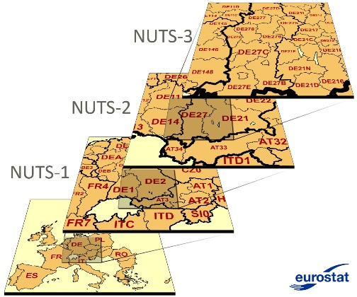
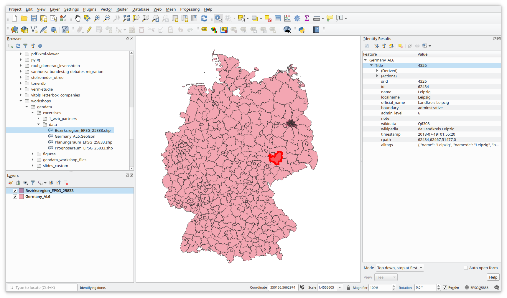

```{r, include=FALSE}
knitr::opts_chunk$set(R.options = list(max.print = 50))
set.seed(10042019)
```

## Today's schedule

TODO: nachträglich anpassen / nummerierung!

1. Introduction
2. A short introduction to plotting with *ggplot2*
3. Hello world: Plotting points on a world map
4. Sources and file formats for geographic data

-- lunch break --

5. A short introduction to data linkage with *dplyr*
6. Combining data and making a *choropleth map*
7. Geo-coding and reverse geo-coding via Google Maps API
8. Making plots publication-ready


# Introduction

## About me

TODO

## Aims of today's workshop

TODO

full flexibility

but even things that look simple are actually quite complex

# A short introduction to plotting with *ggplot2*

## Plotting with *ggplot2* {.build .smaller}

There are three basic steps for constructing plots with *ggplot2*:

1. Supply a data set you want to plot to `ggplot()`.
2. Define an **aesthetic mapping** with `aes()`.<br>
    This describes how variables of your data are mapped to visual properties, e.g. variable "age" is plotted on the x-axis and "income" on the y-axis.
3. Add layers of **geoms** (geometrical objects) that describe which graphical primitives to use (e.g. points in a scatter plot or bars in a bar plot).

Additionally, you can further change the appearance of your plot by: 

- altering the **scales** (e.g. use a logarithmic scale, modify display of factors, etc.)
- defining **facets** &rarr; create *small multiples*, each showing a different subset of the data
- changing the overall appearance of the plot by adjusting its **theme** (e.g. change background color, rotate axis labels, etc.)

You combine all these steps with a `+`.

## General concepts behind *ggplot2*


## General concepts behind *ggplot2*


## General concepts behind *ggplot2*


## General concepts behind *ggplot2*


## General concepts behind *ggplot2*


## General concepts behind *ggplot2*


## General concepts behind *ggplot2*


# Hello world: Plotting points on a world map

## Coordinate reference systems in brief {.smaller .build}

We usually work with two-dimensional *vector data*: Points located within a *coordinate reference system (CRS)*.

```{r, message=FALSE, warning=FALSE, echo=FALSE, fig.width=6, fig.height=2.5, fig.align='center'}
library(ggplot2)
library(maps)
library(sf)

nyc <- st_sfc(st_point(c(-73.94, 40.6)), crs = 4326) 
ggplot() + geom_sf(data = nyc, color = 'red', size = 3) +
    geom_sf_text(data = nyc, label = "-73.94, 40.6", hjust = 0, vjust = 1, nudge_x = 3) +
    coord_sf(xlim = c(-180, 180), ylim = c(-90, 90), expand = FALSE) +
    geom_hline(yintercept = 0, color = 'green') + geom_vline(xintercept = 0, color = 'blue') +
    xlab('longitude') + ylab('latitude') +
    theme_bw()
```

- the point *-73.94°, 40.6°* is represented in the *WGS84* CRS: most popular world coord. system (e.g. used by GPS)
- this CRS is ellipsoidal; its components are given in degrees:
    - *-73.94°* is the **longitude**: about 74° West from the <span style="color:blue">meridian</span>
    - *40.6°* is the **latitude**:  about 41° North from the <span style="color:green">equator</span>


## Coordinate reference systems in brief {.smaller .build}

Let's put this point into context:

```{r, warning=FALSE, fig.width=6, fig.height=3, fig.align='center', echo=FALSE}
worldmap_data <- st_as_sf(map('world', plot = FALSE, fill = TRUE))
ggplot() + geom_sf(data = worldmap_data) + geom_sf(data = nyc, color = 'red', size = 3) +
    geom_sf_text(data = nyc, label = "-73.94, 40.6", hjust = 0, vjust = 1, nudge_x = 3) +
    coord_sf(xlim = c(-180, 180), ylim = c(-90, 90), expand = FALSE) +
    geom_hline(yintercept = 0, color = 'green') + geom_vline(xintercept = 0, color = 'blue') +
    xlab('longitude') + ylab('latitude') +
    theme_bw()
```

- points can be connected to form other geometrical shapes such as *lines* or *polygons*
- points and shapes can represent numerous geographic entities: cities, buildings, countries, rivers, lakes, etc.


## Packages, packages, packages {.build}

We need to extend R in order to work with geographic data *(geo-data)* in R by installing these packages:

- *maps*: contains geo-data for national borders and administrative regions for several countries
- *rgeos* and *maptools*: Misc. functions for operations on geometries
- *sf*: *"Simple Features for R"* -- reading, writing and transforming spatial data

Install them if you haven't yet:

```{r, eval=FALSE}
install.packages(c('maps', 'maptools', 'sf', 'rgeos'))
```


## Simple features {.build .smaller}

Most packages for working with geo-data in R rely on the *Simple Features* standard (&rarr; `sf` package).

*Simple features* describe how objects in the real world can be represented in computers in terms of their *spatial geometry*:

> Features have a *geometry* describing *where* on Earth the feature is located, and they have attributes, which describe other properties.<br>
> -- [`sf` package vignette](https://cran.r-project.org/web/packages/sf/vignettes/sf1.html#what_is_a_feature)

Examples:

<div style="width:50%; float:left;">
- geometry: point at *-73.94°, 40.6°*
- name: New York City
- population: 8.6 mio.
</div>
<div style="width:50%; float:left;">
- geometry: polygons with of points at ...
- name: Italy
- most popular meal: pizza
</div>

<div style="clear:left">
A **spatial dataset** is a dataset that contains geo-data (in a `geometry` column) *and* attributes of that entity like population, poverty rate, etc.
</div>

## Making a world map {.build .smaller}

First, we load the packages that we need:

```{r, warning=FALSE, message=FALSE}
library(ggplot2)
library(maps)
library(sf)
```

## Making a world map {.build .smaller}

The function `map` can be used to load the "world" data. We need to convert it to a "simple features" object via `st_as_sf()`:

```{r}
worldmap_data <- st_as_sf(map('world', plot = FALSE, fill = TRUE))
head(worldmap_data, n = 3)  # to have a look inside
```

- **spatial dataset** with a "header" giving some general information
- two columns: `geometry` (spatial data) and `ID` (attribute)

What do the numbers in the `geometry` column mean? What's their CRS?

## Making a world map {.smaller}

We are ready to plot the world map. Every "simple features" object can be plotted by adding a `geom_sf` layer:

```{r, fig.width=8}
ggplot() + geom_sf(data = worldmap_data)
```


## Putting points on the map {.smaller .build}

We have some cities along with their longitude (`lng`) and latitude (`lat`):

```{r, echo=FALSE}
some_cities <- data.frame(name = c('Berlin', 'New York', 'Sydney'),
                          lng = c(13.38, -73.94, 151.21),
                          lat = c(52.52, 40.6, -33.87))
some_cities
```

We add a "point geom" layer to our map:

```{r, fig.width=6, fig.height=3, fig.align='center'}
ggplot(some_cities) +                                # pass the cities data to plot
    geom_sf(data = worldmap_data) +                  # layer 1: world countries
    geom_point(aes(x = lng, y = lat), color = 'red') # layer 2: points at city coord.
```


## Adding labels next to the points {.smaller .build}

You may also add text labels for the cities. *ggplot2* provides `geom_text` and `geom_label` (draws box around text):

```{r, fig.width=6, fig.height=3, fig.align='center'}
ggplot(some_cities) +                                  # pass the cities data to plot
    geom_sf(data = worldmap_data) +                    # layer 1: world countries
    geom_point(aes(x = lng, y = lat), color = 'red') + # layer 2: points
    geom_label(aes(x = lng, y = lat, label = name),    # layer 3: labels
               hjust = 0, vjust = 1, nudge_x = 3) +    # labels appear next to point
    theme(axis.title = element_blank(),
          axis.text = element_blank())                 # disable the axis labels
```

## Excercise 1 {.smaller}

TODO: Anpassen / 2 mgl. Übungen?

**Visualizing WZB partner institutions on a world map**

Make a script that:

1. Load the CSV file `wzb_partners_data.csv`
2. Load the data for the world map
3. Remove the shape (i.e. the "feature") for Antarctica from the world map data
4. Make a plot, showing the partner institutions with a dot on the world map (optional: make the color dependent on the "type" column)
5. Optional: Group institutions by city and count institutions per city; show the city locations in Europe only as a dot, make the dot size dependent on number of institutions

**See further hints on handout.**

# Sources and file formats for geo-data

## Administrative levels and identifiers {.smaller .build}

Suppose you have observations that refer to geographic locations, e.g. countries, cities, neighborhoods. You may want to:

- **link** that data with existing information on that geographic entity e.g. country GDP, city population, poverty rate in the neighboorhood
- **visualize** that data geographically

For both things you need to:

1. agree on **geographic (administrative) level** for matching (e.g. country, state, municipality)
2. find **identifiers** to match the observations w/ respective geographic entities

TODO: schematische darstellung

## Country names, country codes {.smaller .build}

- different names may refer to the same country (e.g. Germany / Federal Republic of Germany, BRD, etc.) &rarr; often not a good identifier
- ISO 3166-1 designates every country a two- or three-letter code (e.g. DE / DEU)
- often used in datasets (e.g. from the UN)

```{r, echo=FALSE, message=FALSE, warning=FALSE}
library(rnaturalearth)
library(ggrepel)
library(dplyr)

world <- ne_countries(type = 'map_units', returnclass = 'sf', continent = 'europe')
world <- st_transform(world, 3035)
world <- st_crop(world, xmin = 0, xmax = 7e6, ymin = 0, ymax = 5e6)

labelsdf <- data.frame(label = sprintf('%s (%s)\nISO Codes: %s / %s',
                                       world$name, world$formal_en, world$iso_a2, world$iso_a3), stringsAsFactors = FALSE)
#labelsdf$geometry <- st_centroid(world$geometry)
labels_coords <- as.data.frame(st_coordinates(st_centroid(world$geometry)))
labelsdf$x <- labels_coords$X
labelsdf$y <- labels_coords$Y
world$show_label <- sample(c(TRUE, FALSE), nrow(labelsdf), replace = TRUE, prob = c(0.2, 0.8))
labelsdf <- labelsdf[world$show_label, ]

ggplot() + geom_sf(aes(fill = show_label), data = world) +
    geom_label_repel(aes(label = label, x = x, y = y), data = labelsdf, size = 3, min.segment.length = 0, alpha = 0.85) +
    scale_fill_brewer(guide = "none", palette = 'Dark2') +
    labs(title = 'Random sample of European countries w/ ISO codes',
            caption = 'source: Natural Earth Data') +
    theme_bw() +
    theme(axis.text = element_blank(),
          axis.title = element_blank(),
          axis.ticks = element_blank())
```


## Finding NUTS in the EU {.smaller .build}

The *Nomenclature of Territorial Units for Statistics (NUTS)* divides the EU territory into regions at 3 different levels for socio-economic analyses of the regions.

Candidate countries and countries inside EFTA also have NUTS regions (Norway, Switzerland, Albania, Turkey, etc.).

<div class="fullfig">
  <br>
  <small>source: [Eurostat](https://ec.europa.eu/eurostat/web/nuts/background)</small>
</div>

## Finding NUTS in the EU {.smaller}

```{r, echo=FALSE, warning=FALSE}
nutsrg2 <- read_sf('excercises/data/nutsrg_2.json')
st_crs(nutsrg2) <- 3857

labelsdf <- data.frame(label = sprintf('%s: %s', nutsrg2$id, nutsrg2$na), stringsAsFactors = FALSE)
labels_coords <- as.data.frame(st_coordinates(st_centroid(nutsrg2$geometry)))
labelsdf <- bind_cols(labelsdf, labels_coords)
nutsrg2$show_label <- rep(FALSE, nrow(nutsrg2))
nutsrg2$show_label[sample(1:nrow(nutsrg2), 3)] <- TRUE
labelsdf <- labelsdf[nutsrg2$show_label, ]

ggplot() + geom_sf(aes(fill = show_label), data = nutsrg2) +
    geom_label_repel(aes(label = label, x = X, y = Y), data = labelsdf, size = 3, min.segment.length = 0, alpha = 0.85) +
    scale_fill_brewer(guide = "none", palette = 'Dark2') +
    labs(title = 'Random sample of NUTS level 2 regions',
         caption = 'source: Eurostat / https://github.com/eurostat/Nuts2json') +
    theme_bw() +
    theme(axis.text = element_blank(),
          axis.title = element_blank(),
          axis.ticks = element_blank())
```

## AGS in Germany {.smaller .build}

In Germany, regions are hierarchically structured and identified by *"Amtlicher Gemeindeschlüssel" (AGS ~ "municipality identificator")*. The [*Gemeindeverzeichnis*](https://www.destatis.de/DE/Themen/Laender-Regionen/Regionales/_inhalt.html) contains all regions with their name, AGS, area, population and other features.


```{r, echo=FALSE, warning=FALSE}
library(jsonlite)

ger_al6 <- read_sf('excercises/data/Germany_AL6.GeoJson')
ger_al6$ags <- sapply(ger_al6$alltags, function(tags) {
    ags <- fromJSON(tags)[['de:amtlicher_gemeindeschluessel']]
    if (is.null(ags)) {
        NA
    } else {
        ags
    }
}, USE.NAMES = FALSE)

ger_al6 <- select(ger_al6, localname, ags, geometry)
ger_al6 <- st_transform(ger_al6, 5243)

labelsdf <- data.frame(label = sprintf('%s: %s', ger_al6$ags, ger_al6$localname), stringsAsFactors = FALSE)
labels_coords <- as.data.frame(st_coordinates(st_centroid(ger_al6$geometry)))
labelsdf <- bind_cols(labelsdf, labels_coords)
ger_al6$show_label <- rep(FALSE, nrow(ger_al6))
ger_al6$show_label[sample(1:nrow(ger_al6), 5)] <- TRUE
labelsdf <- labelsdf[ger_al6$show_label, ]

ggplot() + geom_sf(aes(fill = show_label), data = ger_al6) +
    geom_label_repel(aes(label = label, x = X, y = Y), data = labelsdf, size = 3, min.segment.length = 0, alpha = 0.85) +
    scale_fill_brewer(guide = "none", palette = 'Dark2') +
    labs(title = 'Random sample of AGS at\nadministrative level 6 ("Kreise")',
         caption = 'source: OpenStreetMap') +
    theme_bw() +
    theme(axis.text = element_blank(),
          axis.title = element_blank(),
          axis.ticks = element_blank())
```


## Berlin: LOR codes {.smaller .build}

Since 2006, Berlin uses *"Lebensweltlich orientierte Räume" (LOR)* to structure the city area into sub-regions at different levels, each of them identified by "LOR" code:

Level 1: *Prognoseräume* (60 regions); Level 2: *Bezirksregionen* (138 regions); Level 3: *Planungsräume* (447 regions)

```{r, echo=FALSE, warning=FALSE}
bln_plan <- read_sf('excercises/data/Planungsraum_EPSG_25833.shp')
bln_plan$PLR_NAME <- iconv(bln_plan$PLR_NAME, from = 'LATIN1', to = 'UTF-8')
st_crs(bln_plan) <- 25833

labelsdf <- data.frame(label = sprintf('%s: %s', bln_plan$SCHLUESSEL, bln_plan$PLR_NAME), stringsAsFactors = FALSE)
labels_coords <- as.data.frame(st_coordinates(st_centroid(bln_plan$geometry)))
labelsdf <- bind_cols(labelsdf, labels_coords)
bln_plan$show_label <- rep(FALSE, nrow(bln_plan))
bln_plan$show_label[sample(1:nrow(bln_plan), 5)] <- TRUE
labelsdf <- labelsdf[bln_plan$show_label, ]

ggplot() + geom_sf(aes(fill = show_label), data = bln_plan) +
    geom_label_repel(aes(label = label, x = X, y = Y), data = labelsdf, size = 3, min.segment.length = 0, alpha = 0.85) +
    scale_fill_brewer(guide = "none", palette = 'Dark2') +
    labs(title = 'Random sample of LOR regions at\n"Planungsraum" level in Berlin',
         caption = 'source: Berlin Senate Department for Urban Development and Housing') +
    theme_bw() +
    theme(axis.text = element_blank(),
          axis.title = element_blank(),
          axis.ticks = element_blank())
```


## What if I have no geo-identifier? {.smaller}

If your observations don't contain the identifiers you need, you can still do the following as long as you have **some information suitable for geo-coding** (e.g. address, city name, institution name to convert to a geo-coordinate):

1. find out the longitude/latitude coordinate for each observation
2. match each coordinate to its surrounding geographic entity (i.e. a municipality) by doing a "point-within-polygon" test

```{r, echo=FALSE, warning=FALSE, fig.height=4, fig.align='center'}
wzb_lon_lat <- c(13.365097, 52.506459)
pt_wzb_df <- data.frame(label = 'WZB')
pt_wzb_df$geometry <- st_transform(st_sfc(st_point(wzb_lon_lat), crs = 4326), 25833)

bln_plan$contains_wzb <- as.logical(st_contains(bln_plan$geometry, pt_wzb_df$geometry))
bln_plan$contains_wzb[is.na(bln_plan$contains_wzb)] <- FALSE

wzb_lor_region <- bln_plan[bln_plan$contains_wzb, c('SCHLUESSEL', 'PLR_NAME')]

ggplot() + geom_sf(aes(fill = contains_wzb), data = bln_plan) +
    geom_sf(data = pt_wzb_df$geometry, color = 'white', size = 3) +
    geom_sf_label(aes(label = label), data = pt_wzb_df, size = 3, alpha = 0.85, nudge_x = 100, nudge_y = -100, hjust = 0, vjust = 1) +
    scale_fill_brewer(guide = "none", palette = 'Dark2') +
    coord_sf(xlim = c(381e3, 399e3), ylim = c(5813e3, 5827e3), expand = FALSE) +
    labs(title = sprintf('LOR region for WZB: %s\n(LOR code %s)', wzb_lor_region$PLR_NAME, wzb_lor_region$SCHLUESSEL),
         subtitle = sprintf('Found for WZB geo-coordinates %.4f, %.4f', wzb_lon_lat[1], wzb_lon_lat[2]),
         caption = 'source: Berlin Sen. Dept. for Urban Dev. and Housing') +
    theme_bw() +
    theme(axis.text = element_blank(),
          axis.title = element_blank(),
          axis.ticks = element_blank())
```

<!--
<small>¹ we will have a look at geo-coding later</small>
<small>² make sure that both use the same coordinate reference system -- see last unit in this workshop</small>
-->

## Sources for geo-data

Have look in the handout document, where geo-data sources at world- and EU-level (NUTS) as well as sources for Germany (AGS) and Berlin (LOR) are presented.

## File formats {.smaller .build}

There are numerous file formats that store data for *geographic information system (GIS)* software. The most popular include:

- ESRI shapefile ("SHP"):
    - consists of at least three files in the same directory with filename extensions `.shp`, `.shx` and `.dbf`
- GeoJSON (`.geojson`, `.json`) and TopoJSON (`.topojson`, `.json`)
- KML (`.kml`, `.kmz`): Keyhole Markup Language, used by Google Earth
- GML (`.gml`): Geography Markup Language
- AutoCAD DXF (`.dxf`)

You may also encounter other formats such as vector data files (`.svg`, `.poly`) or databases (`.sql`, `.sqlite`).

Good news: `sf` can handle all popular file formats.


## Exploring geo-data files with QGIS {.smaller}

[QGIS](https://www.qgis.org/) is a free, open-source GIS software running on all major operating systems.

- useful for exploring downloaded geo-data files
- I will show how to load a geo-data file and investigate properties of individual shapes
- if you've installed QGIS, you can follow along

<div class="fullfig">
  
</div>


# Lunch break

