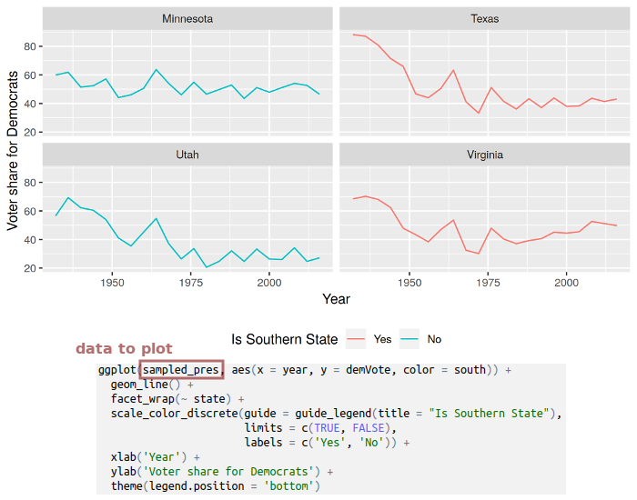
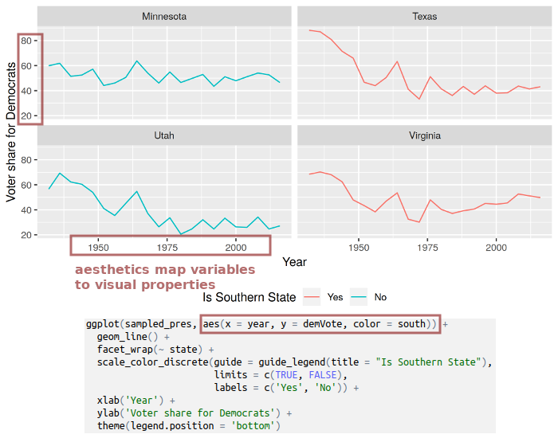
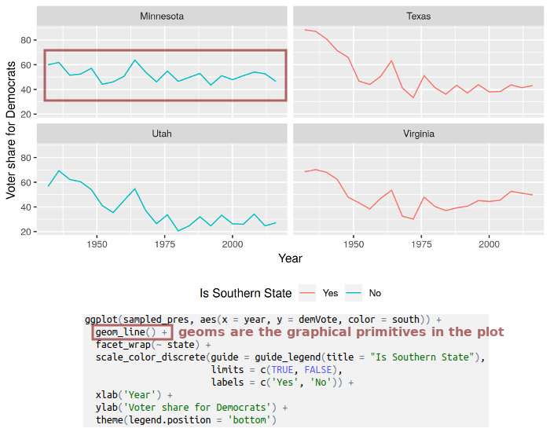
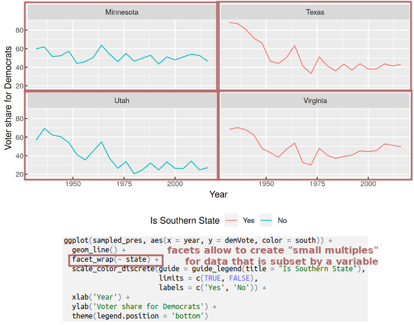
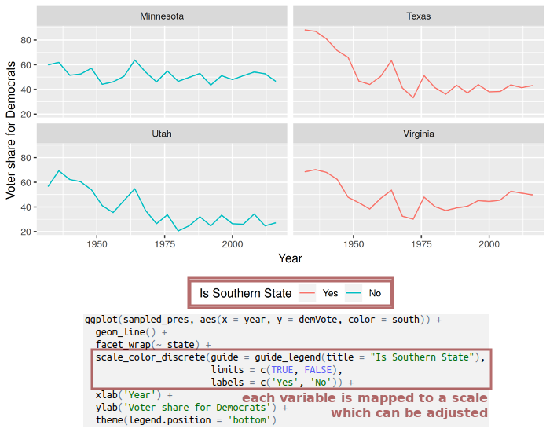
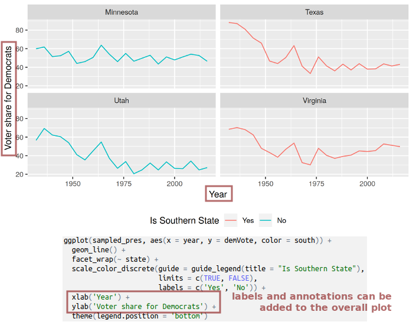
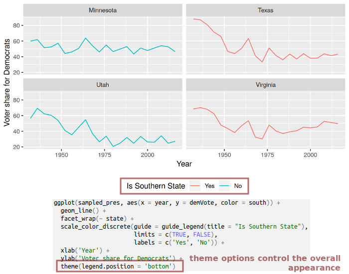

```{r, include=FALSE}
knitr::opts_chunk$set(R.options = list(max.print = 50))
set.seed(10042019)
```

## Today's schedule

TODO: nachträglich anpassen

1. Introduction
2. A short introduction to plotting with *ggplot2*
3. Hello world: Plotting points on a world map
4. Sources and file formats for geographic data

-- lunch break --

2. A short introduction to data linkage with *dplyr*
5. Combining data and making a *choropleth map*
6. Geo-coding and reverse geo-coding via Google Maps API
7. Coordinate reference systems and projections


# Introduction

## About me

TODO

## Aims of today's workshop

TODO

# A short introduction to plotting with *ggplot2*

## Plotting with *ggplot2* {.build .smaller}

There are three basic steps for constructing plots with *ggplot2*:

1. Supply a data set you want to plot to `ggplot()`.
2. Define an **aesthetic mapping** with `aes()`.<br>
    This describes how variables of your data are mapped to visual properties, e.g. variable "age" is plotted on the x-axis and "income" on the y-axis.
3. Add layers of **geoms** (geometrical objects) that describe which graphical primitives to use (e.g. points in a scatter plot or bars in a bar plot).

Additionally, you can further change the appearance of your plot by: 

- altering the **scales** (e.g. use a logarithmic scale, modify display of factors, etc.)
- defining **facets** &rarr; create *small multiples*, each showing a different subset of the data
- changing the overall appearance of the plot by adjusting its **theme** (e.g. change background color, rotate axis labels, etc.)

You combine all these steps with a `+`.

## General concepts behind *ggplot2*



## General concepts behind *ggplot2*



## General concepts behind *ggplot2*



## General concepts behind *ggplot2*



## General concepts behind *ggplot2*



## General concepts behind *ggplot2*



## General concepts behind *ggplot2*



# Hello world: Plotting points on a world map

## Coordinate reference systems in brief {.smaller .build}

We usually work with two-dimensional *vector data*: Points located within a *coordinate reference system (CRS)*.

```{r, message=FALSE, warning=FALSE, echo=FALSE, fig.width=6, fig.height=2.5, fig.align='center'}
library(ggplot2)
library(maps)
library(sf)

nyc <- st_sfc(st_point(c(-73.94, 40.6)), crs = 4326) 
ggplot() + geom_sf(data = nyc, color = 'red', size = 3) +
    geom_sf_text(data = nyc, label = "-73.94, 40.6", hjust = 0, vjust = 1, nudge_x = 3) +
    coord_sf(xlim = c(-180, 180), ylim = c(-90, 90), expand = FALSE) +
    geom_hline(yintercept = 0, color = 'green') + geom_vline(xintercept = 0, color = 'blue') +
    xlab('longitude') + ylab('latitude') +
    theme_bw()
```

- the point *-73.94°, 40.6°* is represented in the *WGS84* CRS: most popular world coord. system (e.g. used by GPS)
- this CRS is ellipsoidal; its components are given in degrees:
    - *-73.94°* is the **longitude**: about 74° West from the <span style="color:blue">meridian</span>
    - *40.6°* is the **latitude**:  about 41° North from the <span style="color:green">equator</span>


## Coordinate reference systems in brief {.smaller .build}

Let's put this point into context:

```{r, warning=FALSE, fig.width=6, fig.height=3, fig.align='center', echo=FALSE}
worldmap_data <- st_as_sf(map('world', plot = FALSE, fill = TRUE))
ggplot() + geom_sf(data = worldmap_data) + geom_sf(data = nyc, color = 'red', size = 3) +
    geom_sf_text(data = nyc, label = "-73.94, 40.6", hjust = 0, vjust = 1, nudge_x = 3) +
    coord_sf(xlim = c(-180, 180), ylim = c(-90, 90), expand = FALSE) +
    geom_hline(yintercept = 0, color = 'green') + geom_vline(xintercept = 0, color = 'blue') +
    xlab('longitude') + ylab('latitude') +
    theme_bw()
```

- points can be connected to form other geometrical shapes such as *lines* or *polygons*
- points and shapes can represent numerous geographic entities: cities, buildings, countries, rivers, lakes, etc.


## Packages, packages, packages {.build}

We need to extend R in order to work with geographic data *(geo-data)* in R by installing these packages:

- *maps*: contains geo-data for national borders and administrative regions for several countries
- *rgeos* and *maptools*: Misc. functions for operations on geometries
- *sf*: *"Simple Features for R"* -- reading, writing and transforming spatial data

Install them if you haven't yet:

```{r, eval=FALSE}
install.packages(c('maps', 'maptools', 'sf', 'rgeos'))
```


## Simple features {.build .smaller}

Most packages for working with geo-data in R rely on the *Simple Features* standard (most prominently the `sf` package).

*Simple features* describe how objects in the real world can be represented in computers in terms of their *spatial geometry*:

> Features have a *geometry* describing *where* on Earth the feature is located, and they have attributes, which describe other properties.
> -- [`sf` package vignette](https://cran.r-project.org/web/packages/sf/vignettes/sf1.html#what_is_a_feature)

Examples:

- geometry: point at *-73.94°, 40.6°*
- name: New York City
- population: 8.6 mio.

<br>

- geometry: polygons consisting of points at ...
- name: Italy
- most popular meal: pizza


## Making a world map {.build .smaller}

First, we load the packages that we need:

```{r, warning=FALSE, message=FALSE}
library(ggplot2)
library(maps)
library(sf)
```

## Making a world map {.build .smaller}

The function `map` can be used to load the "world" data. We need to convert it to a "simple features" object via `st_as_sf()`:

```{r}
worldmap_data <- st_as_sf(map('world', plot = FALSE, fill = TRUE))
head(worldmap_data, n = 3)  # to have a look inside
```

- dataset with a "header" giving some general information
- two columns: `geometry` (spatial data) and `ID` ("meta data")

What do the numbers in the `geometry` column mean? What's their CRS?

## Making a world map {.smaller}

We are ready to plot the world map. Every "simple features" object can be plotted by adding a `geom_sf` layer:

```{r, fig.width=8}
ggplot() + geom_sf(data = worldmap_data)
```


## Putting points on the map {.smaller .build}

We have some cities along with their longitude (`lng`) and latitude (`lat`):

```{r, echo=FALSE}
some_cities <- data.frame(name = c('Berlin', 'New York', 'Sydney'),
                          lng = c(13.38, -73.94, 151.21),
                          lat = c(52.52, 40.6, -33.87))
some_cities
```

We add a "point geom" layer to our map:

```{r, fig.width=6, fig.height=3, fig.align='center'}
ggplot(some_cities) +                                # pass the cities data to plot
    geom_sf(data = worldmap_data) +                  # layer 1: world countries
    geom_point(aes(x = lng, y = lat), color = 'red') # layer 2: points at city coord.
```


## Adding labels next to the points {.smaller}

You may also add text labels for the cities. *ggplot2* provides `geom_text` and `geom_label` (draws box around text):

```{r, fig.width=6, fig.height=3, fig.align='center'}
ggplot(some_cities) +                                  # pass the cities data to plot
    geom_sf(data = worldmap_data) +                    # layer 1: world countries
    geom_point(aes(x = lng, y = lat), color = 'red') + # layer 2: points
    geom_label(aes(x = lng, y = lat, label = name),    # layer 3: labels
               hjust = 0, vjust = 1, nudge_x = 3) +    # labels appear next to point
    theme(axis.title = element_blank(),
          axis.text = element_blank())                 # disable the axis labels
```

## Excercise 1 {.smaller}

TODO: Anpassen / 2 mgl. Übungen?

**Visualizing WZB partner institutions on a world map**

Make a script that:

1. Load the CSV file `wzb_partners_data.csv`
2. Load the data for the world map
3. Remove the shape (i.e. the "feature") for Antarctica from the world map data
4. Make a plot, showing the partner institutions with a dot on the world map (optional: make the color dependent on the "type" column)
5. Optional: Group institutions by city and count institutions per city; show the city locations in Europe only as a dot, make the dot size dependent on number of institutions

**See further hints on handout.**

# Sources and file formats for geo-data

## Administrative levels and identifiers {.smaller .build}

Suppose you have observations that refer to geographic locations, e.g. countries, cities, neighborhoods. You may want to:

- **link** that data with existing information on that geographic entity e.g. country GDP, city population, poverty rate in the neighboorhood
- **visualize** that data geographically

For both things you need to:

1. agree on **geographic (administrative) level** for matching (e.g. country, state, municipality)
2. find **identifiers** to match the observations w/ respective geographic entities

TODO: schematische darstellung

## Country names, country codes {.smaller .build}

- different names may refer to the same country (e.g. Germany / Federal Republic of Germany, BRD, etc.) &rarr; often not a good identifier
- ISO 3166-1 designates every country a two- or three-letter code (e.g. DE / DEU)
- often used in datasets (e.g. from the UN)

```{r, echo=FALSE, message=FALSE, warning=FALSE}
library(rnaturalearth)
library(ggrepel)
library(dplyr)

world <- ne_countries(type = 'map_units', returnclass = 'sf', continent = 'europe')
world <- st_transform(world, 3035)
world <- st_crop(world, xmin = 0, xmax = 7e6, ymin = 0, ymax = 5e6)

labelsdf <- data.frame(label = sprintf('%s (%s)\nISO Codes: %s / %s',
                                       world$name, world$formal_en, world$iso_a2, world$iso_a3), stringsAsFactors = FALSE)
#labelsdf$geometry <- st_centroid(world$geometry)
labels_coords <- as.data.frame(st_coordinates(st_centroid(world$geometry)))
labelsdf$x <- labels_coords$X
labelsdf$y <- labels_coords$Y
world$show_label <- sample(c(TRUE, FALSE), nrow(labelsdf), replace = TRUE, prob = c(0.3, 0.7))
labelsdf <- labelsdf[world$show_label, ]

ggplot() + geom_sf(aes(fill = show_label), data = world) +
    geom_label_repel(aes(label = label, x = x, y = y), data = labelsdf, size = 3, min.segment.length = 0, alpha = 0.85) +
    scale_fill_brewer(palette = 'Blues', guide = "none") +
    ggtitle('A random sample of European countries with their ISO codes') +
    theme_bw() +
    theme(axis.text = element_blank(),
          axis.title = element_blank(),
          axis.ticks = element_blank())
```


## Finding NUTS in the EU {.smaller .build}

https://en.wikipedia.org/wiki/Nomenclature_of_Territorial_Units_for_Statistics

also Turkey, Iceland, Norway, Switzerland, ...

plot: NUTS codes

## AGS in Germany

"Amtlicher Gemeindeschlüssel" (AGS ~ "municipality identificator")

plot

## Berlin: LOR codes

hierarchical spaces reaching from 60 larger areas to fine-grained 447 neighborhoods in Berlin

plot


## What if I have no geo-identifier?

If your observations don't contain the identifiers you need, you can still do the following as long as you have **some information suitable for geo-coding**¹ (e.g. address, city name, institution name):

1. find out the longitude/latitude coordinate for each observation
2. match each coordinate to its surrounding geographic entity (i.e. a municipality) by doing a "point-within-polygon" test²

TODO: plot dots within regions

<small>¹ we will have a look at geo-coding later</small>
<small>² make sure that both use the same coordinate reference system -- see last unit in this workshop</small>

## Sources for geo-data

Have look in the handout document, where geo-data sources at world- and EU-level (NUTS) as well as sources for Germany (AGS) and Berlin (LOR) are presented.

## File formats {.smaller .build}

There are numerous file formats that store data for *geographic information system (GIS)* software. The most popular include:

- ESRI shapefile ("SHP"):
    - consists of at least three files in the same directory with filename extensions `.shp`, `.shx` and `.dbf`
- GeoJSON (`.geojson`, `.json`) and TopoJSON (`.topojson`, `.json`)
- KML (`.kml`, `.kmz`): Keyhole Markup Language, used by Google Earth
- GML (`.gml`): Geography Markup Language
- AutoCAD DXF (`.dxf`)

You may also encounter other formats such as vector data files (`.svg`, `.poly`) or databases (`.sql`, `.sqlite`).

Good news: `sf` can handle all popular file formats.


## QGIS as a geographic information system


# A short introduction to data linkage with *dplyr*

## Data linkage with *dplyr* {.smaller .build}

```{r, include=FALSE}
pm <- data.frame(city = c('Amman', 'Saltillo', 'Usak', 'The Bronx', 'Seoul'),
                 pm_mg = c(999, 869, 814, 284, 129),
                 stringsAsFactors = FALSE)
city_coords <- data.frame(city = c('Amman', 'Saltillo', 'Berlin', 'Usak', 'New York', 'Seoul'),
                          lng = c(31.910341, 1, 1, 1, 1, 1),
                          lat = c(35.948458, 1, 1, 1, 1, 1),
                          stringsAsFactors = FALSE)
```

Two datasets:

```{r, echo=FALSE}
knitr::kable(pm, caption = 'Particular matter: "pm" dataset', align = 'l', format = "html", table.attr = 'class="table table-condensed small left"')
```

```{r, echo=FALSE}
knitr::kable(city_coords, caption = 'GPS coordinates of cities: "city_coords" dataset', align = 'l', format = "html", table.attr = 'class="table table-condensed small"')
```

<div style="clear:both"><br></div>

- to combine these datasets, the "city" column might be used as identifier for matching
- not all cities in "pm" also appear in "city_coords" and vice versa


## Join operations {.smaller .build}

```{r, echo=FALSE}
knitr::kable(pm, caption = 'pm', align = 'l', format = "html", table.attr = 'class="table table-condensed small left"')
```

```{r, echo=FALSE}
knitr::kable(city_coords, caption = 'city_coords', align = 'l', format = "html", table.attr = 'class="table table-condensed small"')
```

<div style="clear:both"></div>

<br>Datasets can also be joined with `merge`, but I find *dplyr* easier to use.

`left_join(a, b, by = <criterion>)`: **always retains rows on the "left side"** and fills up non-matching rows with *NA*s.

```{r, warning=FALSE, message=FALSE}
library(dplyr)
left_join(pm, city_coords, by = 'city')
```

## Join operations {.smaller .build}

```{r, echo=FALSE}
knitr::kable(pm, caption = 'pm', align = 'l', format = "html", table.attr = 'class="table table-condensed small left"')
```

```{r, echo=FALSE}
knitr::kable(city_coords, caption = 'city_coords', align = 'l', format = "html", table.attr = 'class="table table-condensed small"')
```

<div style="clear:both"></div>

<br>`right_join(a, b, by = <criterion>)`: **always retains rows on the "right side"** and fills up non-matching rows with *NA*s. **How many rows do you expect for a right join between `pm` and `city_coords`? How many of them will contain an *NA* value?**

```{r}
right_join(pm, city_coords, by = 'city')
```


## Join operations {.smaller .build}

```{r, echo=FALSE}
knitr::kable(pm, caption = 'pm', align = 'l', format = "html", table.attr = 'class="table table-condensed small left"')
```

```{r, echo=FALSE}
knitr::kable(city_coords, caption = 'city_coords', align = 'l', format = "html", table.attr = 'class="table table-condensed small"')
```

<div style="clear:both"></div>

<br>`inner_join(a, b, by = <criterion>)`: **only retains rows that match on both sides.**

How many rows do you expect for an inner join between `pm` and `city_coords`?

```{r}
inner_join(pm, city_coords, by = 'city')
```


# Geographic coordinate systems and projections

## Vector data

## Coordinate reference systems and units

```{r}
(norway <- worldmap_data[worldmap_data$ID == 'Norway',])
```

```{r, fig.width=8}
ggplot() + geom_sf(data = norway)
```


## Projections

## Further reading

- sf vignette
- https://cran.r-project.org/web/views/Spatial.html
- https://geocompr.robinlovelace.net/
- ggplot2

