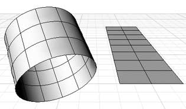
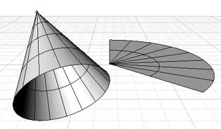
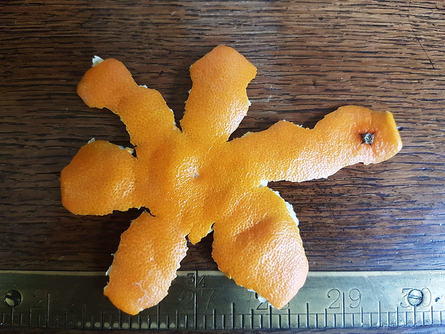
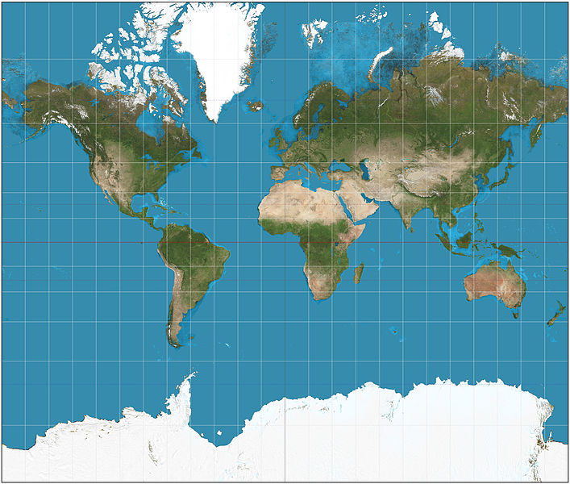
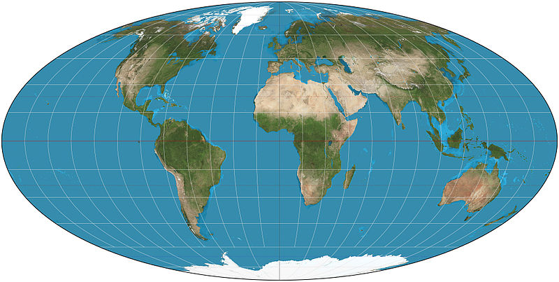
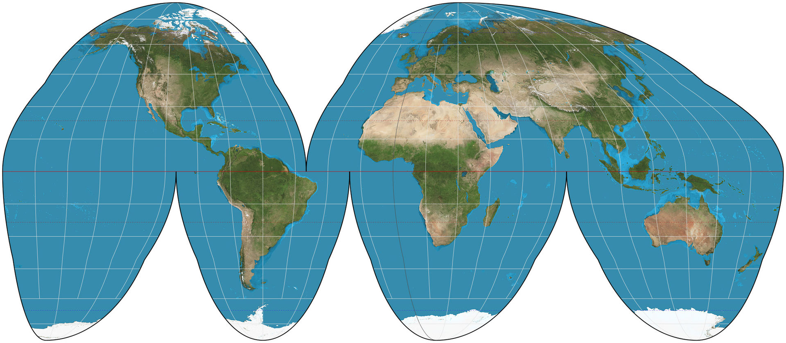

```{r, include=FALSE}
knitr::opts_chunk$set(R.options = list(max.print = 30))
set.seed(10042019)

source('apikeys.R')

library(sf)
library(maps)
library(ggplot2)
```

# A short introduction to data linkage with *dplyr*

## Data linkage with *dplyr* {.smaller .build}

```{r, include=FALSE}
pm <- data.frame(city = c('Amman', 'Saltillo', 'Usak', 'The Bronx', 'Seoul'),
                 pm_mg = c(999, 869, 814, 284, 129),
                 stringsAsFactors = FALSE)
city_coords <- data.frame(city = c('Amman', 'Saltillo', 'Berlin', 'Usak', 'New York', 'Seoul'),
                          lng = c(31.910,   -100.994,   13.402,    29.403, -73.94,    126.983762),
                          lat = c(35.948,    25.434,    52.520,    38.673,  40.6,     37.536256),
                          stringsAsFactors = FALSE)
```

Two datasets:

```{r, echo=FALSE}
knitr::kable(pm, caption = 'Particular matter: "pm" dataset', align = 'l', format = "html", table.attr = 'class="table table-condensed small left"')
```

```{r, echo=FALSE}
knitr::kable(city_coords, caption = 'GPS coordinates of cities: "city_coords" dataset', align = 'l', format = "html", table.attr = 'class="table table-condensed small"')
```

<div style="clear:both"><br></div>

- to combine these datasets, the "city" column might be used as identifier for matching
- not all cities in "pm" also appear in "city_coords" and vice versa


## Join operations {.smaller .build}

```{r, echo=FALSE}
knitr::kable(pm, caption = 'pm', align = 'l', format = "html", table.attr = 'class="table table-condensed small left"')
```

```{r, echo=FALSE}
knitr::kable(city_coords, caption = 'city_coords', align = 'l', format = "html", table.attr = 'class="table table-condensed small"')
```

<div style="clear:both"></div>

<br>Datasets can also be joined with `merge`, but I find *dplyr* easier to use.

`left_join(a, b, by = <criterion>)`: **always retains rows on the "left side"** and fills up non-matching rows with *NA*s.

```{r, warning=FALSE, message=FALSE}
library(dplyr)
left_join(pm, city_coords, by = 'city')
```

## Join operations {.smaller .build}

```{r, echo=FALSE}
knitr::kable(pm, caption = 'pm', align = 'l', format = "html", table.attr = 'class="table table-condensed small left"')
```

```{r, echo=FALSE}
knitr::kable(city_coords, caption = 'city_coords', align = 'l', format = "html", table.attr = 'class="table table-condensed small"')
```

<div style="clear:both"></div>

<br>`right_join(a, b, by = <criterion>)`: **always retains rows on the "right side"** and fills up non-matching rows with *NA*s. **How many rows do you expect for a right join between `pm` and `city_coords`? How many of them will contain an *NA* value?**

```{r}
right_join(pm, city_coords, by = 'city')
```


## Join operations {.smaller .build}

```{r, echo=FALSE}
knitr::kable(pm, caption = 'pm', align = 'l', format = "html", table.attr = 'class="table table-condensed small left"')
```

```{r, echo=FALSE}
knitr::kable(city_coords, caption = 'city_coords', align = 'l', format = "html", table.attr = 'class="table table-condensed small"')
```

<div style="clear:both"></div>

<br>`inner_join(a, b, by = <criterion>)`: **only retains rows that match on both sides.**

How many rows do you expect for an inner join between `pm` and `city_coords`?

```{r}
inner_join(pm, city_coords, by = 'city')
```

# Combining data and making a *choropleth map*

## What is a *choropleth map*? {.smaller .build}

In a *choropleth map*, regions are shaded according to the measurement of some variable, e.g.:

<div class="fullfig">
  <br>
  <small>source: [United Nations, "Water for life action"](https://www.un.org/waterforlifedecade/scarcity.shtml)</small>
</div>

The above picture is a good example of a bad color scheme.

## Making a choropleth map {.smaller .build}

- data downloaded from the Berlin Senate Dept. for Urban Dev. and Housing via [FIS Broker](https://fbinter.stadt-berlin.de/fb/index.jsp)
- includes indicators for monitoring of social development (*"Monitoring Soziale Stadtentwicklung 2017"*):

```{r}
bln_sozind <- read_sf('data/bln_plr_sozind.geojson')
head(bln_sozind)
```

## Making a choropleth map {.smaller}

```{r, echo=FALSE}
head(bln_sozind[c('PLANNAME', 'STATUS4', 'geometry')], 3)
```

- source: FIS Broker, *"Monitoring Soziale Stadtentwicklung 2017"*¹
- aim: visualize spatial distrib. of variable **`STATUS4` -- child poverty rate in percent²**
- dataset is already a **spatial dataset** containing geo-data in `geometry` column

<small>¹ Note that the FIS-Broker website is kind of awkward to use and you can't link directly to dataset, but you have to search for the mentioned keywords.</small><br>
<small>² Portion of children under 15 living in household that obtains social support ("Hartz IV")</small>


## Making a choropleth map {.smaller .build}

Directly plotting the map with fill color depending on `STATUS4`:

```{r, fig.height=3.5, fig.align='center'}
ggplot() + geom_sf(aes(fill = STATUS4), data = bln_sozind)
```

Problem: `STATUS4` is continuous and so is the color scale. For choropleth maps, discrete ranges are better for discerning the colors.


## Making a choropleth map {.smaller .build}

Put the percentages into 5 discrete bins, change the color palette, adjust the appearance:

```{r, fig.height=3.5, fig.align='center'}
bln_sozind$child_pov_bins <- cut(bln_sozind$STATUS4, seq(0, 100, by = 20))
ggplot() + geom_sf(aes(fill = child_pov_bins), data = bln_sozind) +
    scale_fill_brewer(palette = 'OrRd', na.value = "grey90",
                      guide = guide_legend(title = 'Child pov.\nranges in pct.')) +
    coord_sf(datum = NA) +  # disable lines ("graticule") in the background
    theme_void()
```

## Combining data {.smaller .build}

Most of the time, you have at least two datasets: one containing the measurement(s) you want to show, the other containing the geo-data.

Example dataset: [People at risk of poverty or social exclusion by NUTS 2 regions (*tgs00107*)](https://ec.europa.eu/eurostat/web/regions/data/main-tables) from Eurostat.

```{r}
pov_risk <- read.csv('data/tgs00107_pov_risk_nuts2.csv',
                     stringsAsFactors = FALSE)
pov_risk$risk_pct_bins <- cut(pov_risk$risk_pct, seq(0, 100, by = 10))

pov_risk_2016 <- filter(pov_risk, year == 2016)   # 2016 has fewest NAs
head(pov_risk_2016)
```

## Combining data {.smaller .build}

We load the [GeoJSON dataset for NUTS level-2 regions provided by Eurostat](https://github.com/eurostat/Nuts2json):

```{r, warning=FALSE, message=FALSE}
nutsrg2 <- read_sf('data/nutsrg_2.json')
st_crs(nutsrg2) <- 3857  # set the correct CRS
head(nutsrg2)
```

## Combining data {.smaller .build}

Both datasets contain a NUTS level-2 identifier so we can join them:

```{r}
pov_risk_2016_geo <- left_join(nutsrg2, pov_risk_2016, by = c('id' = 'nuts'))
head(pov_risk_2016_geo)
```

## Plotting the combined data {.smaller .build}

```{r, warning=FALSE, message=FALSE, fig.height=3.5, fig.align='center'}
(eu_pov_plt <- ggplot() + geom_sf(aes(fill = risk_pct_bins),
                                  data = pov_risk_2016_geo, size = 0.1) +
  scale_fill_brewer(palette = 'OrRd', na.value = "grey90", guide =
                        guide_legend(title = 'Pct. of people at\nrisk of poverty')) +
  labs(title = 'Poverty in the EU 2016',
       subtitle = 'Percentage of people at risk of poverty or social exclusion',
       caption = 'source: Eurostat') +
  coord_sf(datum = NA) +  # disable lines ("graticule") in the background
  theme_void())
```

## Plotting the combined data

```{r, echo=FALSE, warning=FALSE, fig.align='center'}
eu_pov_plt
```

## Exercises 4 and 5 {.even-smaller}

**Choose *one* of the following two tasks (or make both if you like) and have a look at the handout for further hints:**

**4. A choropleth map of social indicators in Berlin**

- load the CSV file `bln_plr_sozind_data.csv` from folder `4_berlin_sozind`
- load the spatial dataset `bln_plr.geojson` containing the Berlin "Planungsraum" regions
- join both datasets so that you obtain a combined spatial dataset with the social indicators for their respective regions
- make a simple choropleth map with a social indicator of your choice
- make choropleth map of a variable with discrete bins from a social indicator

**5. A choropleth map for unemployment rates in the EU**

- load the CSV file `tgs00010_unempl_nuts2.csv` from folder `5_eu_unempl`
- create a subset with only the data from 2016 in it and create a variable with discrete bins for `unempl_pct`
- load the spatial dataset `nutsrg_2_2016_epsg3857_20M.json` containing the EU NUTS level-2 regions
- join both datasets so that you obtain a combined spatial dataset with the unemployment rates from `tgs00010_unempl_nuts2.csv` for their respective regions in `nutsrg_2_2016_epsg3857_20M.json`
- make a choropleth map for the total unemployment rate (`sex == 'T'`)
- optional: make small multiples (via "facetting") by variable `sex`, i.e. displaying choropleth maps for the unemployment rate of women and men next to each other


## Visualizing spatio-temporal data

If you also have a time-dimension in your data that you want to show, there are several options:

- using *small multiples* via ggplot facetting
- using animations via `gganimate`
- making an interactive map (e.g. with a "time slider")

## Visualizing spatio-temporal data {.smaller}

*Small multiples:* Dataset with time-related variable; plotted with facets (e.g. `facet_wrap()`)

```{r, echo=FALSE, warning=FALSE, message=FALSE, fig.height=5}
# 1. assign each year in the poverty data the corresponding year of the map
pov_risk_10_to_16 <- filter(pov_risk, year %in% seq(2010, 2016, by = 2))
pov_risk_10_to_16 <- mutate(pov_risk_10_to_16, map_year = case_when(year < 2013 ~ 2010L,
                                                                    year == 2014 ~ 2013L,
                                                                    year > 2014 ~ 2016L))

# 2. load geo-data for each available year (2010, 2013 and 2016)
map_yrs <- unique(pov_risk_10_to_16$map_year)
nutsrg2_per_yr <- list()
i <- 1
for (yr in map_yrs) {
    nutsrg2_per_yr[[i]] <- read_sf(sprintf('data/nutsrg_2_%d_epsg3857_20M.json', yr))
    nutsrg2_per_yr[[i]]$map_year <- yr
    st_crs(nutsrg2_per_yr[[i]]) <- 3857  # set the correct CRS
    i <- i + 1
}

# generate a single data frame with each year's geo-data
nutsrg2_all_yrs <- do.call(rbind, nutsrg2_per_yr)

# join geo-data and poverty data also on year level
pov_risk_10_to_16_geo <- left_join(nutsrg2_all_yrs, pov_risk_10_to_16, by = c('id' = 'nuts', 'map_year'))

# repeat missing geo-data for each year and set the respective year
yr10_na <- filter(pov_risk_10_to_16_geo,  map_year == 2010L & is.na(year))
yr10_na$year <- 2010
pov_risk_10_to_16_geo <- rbind(pov_risk_10_to_16_geo, yr10_na)
yr10_na$year <- 2012
pov_risk_10_to_16_geo <- rbind(pov_risk_10_to_16_geo, yr10_na)
yr13_na <- filter(pov_risk_10_to_16_geo,  map_year == 2013L & is.na(year))
yr13_na$year <- 2014
pov_risk_10_to_16_geo <- rbind(pov_risk_10_to_16_geo, yr13_na)
yr16_na <- filter(pov_risk_10_to_16_geo,  map_year == 2016L & is.na(year))
yr16_na$year <- 2016
pov_risk_10_to_16_geo <- rbind(pov_risk_10_to_16_geo, yr16_na)

# drop the rows with the missing geo-data
pov_risk_10_to_16_geo <- filter(pov_risk_10_to_16_geo, !is.na(year))

# 3. make the map using facets
ggplot() + geom_sf(aes(fill = risk_pct_bins), data = pov_risk_10_to_16_geo, size = 0.1) +
    scale_fill_brewer(palette = 'OrRd', na.value = "grey90",
                      guide = guide_legend(title = 'Pct. of people at\nrisk of poverty')) +
    labs(title = 'Poverty in southern EU 2016 (NUTS level-2)',
         subtitle = 'Percentage of people at risk of poverty or social exclusion',
         caption = 'source: Eurostat') +
    coord_sf(datum = NA, xlim = c(-12e5, 35e5), ylim = c(41e5, 68e5)) +
    facet_wrap(~ year, nrow = 2) +   # facets per year
    theme_bw() + theme(axis.text = element_blank(), axis.title = element_blank(),
                       axis.ticks = element_blank(), legend.position = 'bottom')
```

## Visualizing spatio-temporal data {.smaller}

Animations: Use `gganimate` for time-lapse plot animations.

<div style="width: 80%">
```{r, echo=FALSE, warning=FALSE, message=FALSE, fig.width=3.5, fig.height=2.5, align='center'}
library(gganimate)

ggplot() + geom_sf(aes(fill = risk_pct_bins), data = pov_risk_10_to_16_geo, size = 0.1) +
    scale_fill_brewer(palette = 'OrRd', na.value = "grey90",
                      guide = 'none') +
    coord_sf(datum = NA, xlim = c(-12e5, 35e5), ylim = c(41e5, 68e5)) +
    theme_bw() + theme(axis.text = element_blank(), axis.title = element_blank(),
                       axis.ticks = element_blank(), legend.position = 'bottom',
                       title = element_text(size = 7),
                       legend.text = element_text(size = 5)) +
    labs(title = 'Poverty in southern EU {current_frame} (NUTS level-2)',
         subtitle = 'Percentage of people at risk of poverty or social exclusion',
         caption = 'source: Eurostat') +
    transition_manual(year)
```
</div>

## Visualizing spatio-temporal data {.smaller}

- interactive plots (e.g. with a "time-slider") are harder to do
- interactive maps can be made in R with packages [leaflet](https://cran.r-project.org/web/packages/leaflet/index.html) or [Shiny](http://shiny.rstudio.com/)
- more sophisticated maps may require lots of programming effort

<div class="fullfig">
  <br>
  <small>[Helbig, Konrad, Nikolai 2018 / https://schulenkarte.wzb.eu](https://schulenkarte.wzb.eu)</small>
</div>


# Geocoding and reverse geocoding via Google Maps API

## What is geocoding? {.smaller .build}

**Geocoding** is the process of finding the geographic coordinates (longitude, latitude) for a specific query term (a full address, a postal code, a city name etc.).

- *Reichpietschufer 50, 10785 Berlin* &rarr; `13.36509, 52.50640`
- *cute cat cafe new york* &rarr; `-73.896916, 40.706934`

**Reverse geocoding** tries to map a set of geographic coordinates to a place name / address.

- `13.36509, 52.50640` &rarr; *Reichpietschufer 50, 10785 Berlin*


## Getting access {.smaller .build}

The [Google Maps API](https://cloud.google.com/maps-platform/) is a web service that allows programmatic geocoding or reverse geocoding (among other things). Put simply, this means:

- you send a list of queries (e.g. addresses) to a Google server
- the server responds with a list of geo-coordinates

As of June 2018, the Maps API is part of Google's "Could Platform". This requires you to have:

1. A Google account (surprise!).
2. Start a [Google Cloud Platform (GCP)](https://cloud.google.com/) free trial (valid for one year).
3. Register for billing (they want your credit card).<br>
    They promise not to charge it after the end of the free trial...

Inside GCP, you can go to *APIs & Services > Credentials* to get your API key.


## Using *ggmap* for geocoding {.build .smaller}

You need to install the package *ggmap*, at least of version 2.7.

```{r, message=FALSE}
library(ggmap)

# provide the Google Cloud API key here:
register_google(key = google_cloud_api_key)

places <- c('Berlin', 'Leipzig', '10317, Deutschland',
            'Reichpietschufer 50, 10785 Berlin')
place_coords <- geocode(places) %>% mutate(place = places)
place_coords
```


## Reverse geocoding {.build .smaller}

Take the WZB's geo-coordinates and see if we can find the address to it:

```{r, message=FALSE}
# first longitude, then latitude
revgeocode(c(13.36509, 52.50640))
```

Social media posts or digital photos often contain geo-coordinates that you may want to "reverse geocode".


# Making your maps publication-ready


## Map projections {.build}

Can you unroll a cylinder or a cone to a sheet without tearing or stretching?

Yes, easily:

<div style="width:100%">


<div style="clear:left"><small>source: [rhino3.de](http://www.rhino3.de/design/modeling/developable/)</small></div>
</div>


## Map projections {.build}

Spheres or ellipsoids cannot be unrolled or unfolded without cutting or stretching. They are "non-developable surfaces".


<div class="fullfig">
  <br>
  <small>source: [flickr.com/photos/waferboard](https://www.flickr.com/photos/waferboard/45811651315)</small>
</div>


## Coordinate reference systems (again) and projections {.build .smaller}

Map projections try to do the impossible: project points on a sphere¹ to a plane.

- we already worked with WGS84 coordinates, which are locations on a sphere¹ defined as degrees
    - *-73.94°* is the **longitude**: about 74° West from the <span style="color:blue">meridian</span>
    - *40.6°* is the **latitude**:  about 41° North from the <span style="color:green">equator</span>
- points from spherical/ellipsoidal coordinate system are converted to a "flat surface" cartesian coordinate system via a **map projection**
- a coordinate reference system (CRS) can define a specific **map projection**

<small>¹ WGS84 actually models the Earth as ellipsoid</small>


## Map projections {.build}

**All map projections distort:** area, shape, direction, distance and other properties can be different than on the actual sphere.

<div class="fullfig">
  <br>
  <small>source: [flickr.com/photos/waferboard](https://www.flickr.com/photos/waferboard/45811651315)</small>
</div>

There are numerous projections, each with different properties and trade-offs between distortions.

## Example projections {.smaller}

**Mercator projection**

<div class="fullfig">
  <br>
  <small>source: [Strebe / wikipedia commons](https://commons.wikimedia.org/wiki/File:Mercator_projection_SW.jpg)</small>
</div>

- very popular
- strong distortions when far away from equator (Scandinavia, Antarctica, etc.)


## Example projections {.smaller}

**Mollweide projection**

<div class="fullfig">
  <br>
  <small>source: [Strebe / wikipedia commons](https://en.wikipedia.org/wiki/File:Mollweide_projection_SW.jpg)</small>
</div>

- equal-area projection
- shape distortions when far away from center


## Example projections {.smaller}

**Goode homolosine projection**

<div class="fullfig">
  <br>
  <small>source: [Strebe / wikipedia commons](https://commons.wikimedia.org/wiki/File:Goode_homolosine_projection_SW.jpg)</small>
</div>

- equal-area projection
- no distortion around equator
- looks a bit like the peeled orange

## Why should I even care?

- spatial datasets usually specify the CRS &rarr; you should be able to set or transform it<br><br>
- you may want to use a different projection, because:
    - a different projection gives less distortion in the area of your interest (many historical projections are Euro-centric)
    - inequal area projections give too much visual weight on certain regions (i.e. Northern and Southern regions in Mercator projection)<br><br>
- compatibility between datasets matters (e.g. country shapes in specific CRS, but geo-coded points as WGS84 coordinates)

## Why should I even care? {.smaller .build}

```{r, warning=FALSE, message=FALSE, include=FALSE}
library(rnaturalearth)
worldmap_data <- ne_countries(type = 'map_units', returnclass = 'sf')
```


<div style="float:left;width:50%">
```{r, echo=FALSE, warning=FALSE, message=FALSE, fig.width=3.8}
disp_window <- st_sfc(st_point(c(-20, 30)), st_point(c(45, 73)), crs = 4326)
disp_window_mercator <- st_transform(disp_window, crs = 3395)
disp_window_mercator_coord <- st_coordinates(disp_window_mercator)

ggplot() + geom_sf(data = worldmap_data) +
    coord_sf(crs = 3395, datum = 3395,
             xlim = disp_window_mercator_coord[,'X'],
             ylim = disp_window_mercator_coord[,'Y'],
             expand = FALSE) +
    ggtitle('Mercator projection') +
    theme_bw() +
    theme(axis.text.x = element_text(angle = 90, vjust = 0.5))
```
</div>
<div style="float:left;width:50%">
```{r, echo=FALSE, warning=FALSE, message=FALSE, fig.width=3.8}
disp_window <- st_sfc(st_point(c(-12, 27)), st_point(c(60, 65)), crs = 4326)
disp_window_etrs89 <- st_transform(disp_window, crs = 25833)
disp_window_etrs89_coord <- st_coordinates(disp_window_etrs89)

ggplot() + geom_sf(data = worldmap_data) +
    coord_sf(crs = 25833, datum = 25833,
             xlim = disp_window_etrs89_coord[,'X'],
             ylim = disp_window_etrs89_coord[,'Y']) +
    ggtitle('ETRS89 projection') +
    theme_bw() +
    theme(axis.text.x = element_text(angle = 90, vjust = 0.5))
```
</div>

<div style="clear:both">
- ETRS89 projection is especially for (central) Europe: less distorted here
- look at the axis: units are meters, not degrees!
</div>

## Finding out the CRS {.smaller .build}

The CRS of a spatial dataset is usually documented as **EPSG / SRID number**. [epsg.io](http://epsg.io) provides information about all common CRS.<br>
When you load a spatial dataset you can see its CRS / projection:

```{r}
worldmap_data <- st_as_sf(map('world', plot = FALSE, fill = TRUE))
head(worldmap_data, n=2)
```

Alternatively, use `st_crs()`:

```{r}
st_crs(worldmap_data)
```


## Setting a CRS {.smaller .build}

Often, the CRS is not set in the spatial dataset, so you have to do it manually:

```{r}
bln_plan <- read_sf('data/Planungsraum_EPSG_25833.shp')
head(bln_plan, n=2)
```

The documentation (and the file name) say it's [EPSG 25833](http://epsg.io/25833), a CRS known as *ETRS89*:

```{r}
st_crs(bln_plan) <- 25833
```

## Setting a CRS {.smaller .build}

Note that by default, ggplot displays lines ("graticule") and axes according to WGS84 coordinates, although the actual data uses a different CRS:

```{r, fig.height=4, fig.align='center'}
ggplot() + geom_sf(data = bln_plan)
```


## Setting a CRS {.smaller}

Setting the `datum` to the same CRS in `coord_sf` shows axis with the same units as in the data:

```{r, fig.height=4, fig.align='center'}
ggplot() + geom_sf(data = bln_plan) + coord_sf(datum = 25833)
```


## Transforming the CRS {.smaller .build}

Suppose we wanted to make some markers on the Berlin map. We obtained longitude/latitude coordinates for them, e.g. for the WZB:

```{r, fig.height=4, fig.align='center'}
wzb_coord <- data.frame(lng = 13.365097, lat = 52.506459)
ggplot() + geom_sf(data = bln_plan) +
    geom_point(aes(x = lng, y = lat), data = wzb_coord, color = 'red')
```

## Transforming the CRS {.smaller .build}

Oops! What happened here?

The spatial data for Berlin has a different CRS, it doesn't use WGS84 longitude/latitude coordinates. We have to convert the WZB coordinates to the same CRS (EPSG 25833 aka ETRS89) via `st_transform()`:


```{r, fig.height=3.5, fig.align='center'}
wzb_wgs84 <- st_sfc(st_point(c(wzb_coord$lng, wzb_coord$lat)), crs = 4326)
wzb_etrs89 <- as.data.frame(st_coordinates(st_transform(wzb_wgs84, crs = 25833)))
ggplot() + geom_sf(data = bln_plan) +
    geom_point(aes(x = X, y = Y), data = wzb_etrs89, color = 'red')
```


## Setting the display window {.build}

You may only want to show a portion of your spatial data, i.e. "zoom in" to a certain area on the map.

We use spatial data for all countries from the `rnaturalearth` package:

```{r}
worldmap <- ne_countries(type = 'map_units', returnclass = 'sf')
```

## Using a subset of the data {.smaller .build}

One way to "zoom in" is to form a subset of your data, e.g:

```{r, fig.height=1.8, fig.width=5, fig.align='center'}
europe <- worldmap[worldmap$continent == 'Europe',]
ggplot() + geom_sf(data = europe)
```

However, this has some disadvantages:

- you probably wouldn't want to show whole Russia
- nearby countries are not shown (e.g. Turkey, Northern Africa)

## Limiting the display window {.smaller .build}

We can also use the whole dataset, but set limits on the display window via `coord_sf()` **using the current CRS unit** (here: degrees longitude/latitude):

- `xlim` are the bounds for the x-axis 
- `ylim` are the bounds for the y-axis

Using the default Mercator-like projection:

```{r, fig.height=3, fig.align='center'}
ggplot() + geom_sf(data = worldmap) +
    coord_sf(xlim = c(-20, 45), ylim = c(30, 73))
```


## Cutting the shapes {.smaller .build}

We can also "cut" the shapes to fit into the specified display window using `st_crop`:

To better see the effect, I'm showing the result in ETRS89 projection **after** the shapes have been cut:

```{r, fig.height=4, fig.align='center', warning=FALSE, message=FALSE}
europe <- st_crop(worldmap, xmin = -20, xmax = 45, ymin = 30, ymax = 73)
ggplot() + geom_sf(data = europe) + coord_sf(crs = 25833)
```


## Finding centroids of regions {.smaller .build}

Sometimes you need to find the center point *(centroid)* of certain regions. Example: you want to annotate a map with labels for certain countries. You can't directly label a country, because it is represented as a polygon but you need a discrete point for labelling. You can find the centroid for a shape with `st_centroid`.

- `st_centroid` doesn't work correctly with longitude/latitude &rarr; need to convert to a CRS that uses meters, such as ETRS89
- we select 5 countries
- we calculate the centroid points from the countries' `geometry` and get their coordinates (they are also in ETRS89)

```{r}
world_etrs89 <- st_transform(worldmap, crs = 25833)
countries <- world_etrs89[world_etrs89$iso_a2 %in% c('SK', 'FR', 'TR', 'PL', 'CZ'),]
country_centroids <- st_coordinates(st_centroid(countries$geometry))
country_centroids
```


## Labelling regions {.smaller .build}

We can use those coordinates for labelling the countries. First we combine the country names and their centroid coordinates:

```{r}
country_labels <- cbind(select(countries, name), country_centroids)
country_labels
```

## Labelling regions {.smaller .build}

Now we can use `geom_sf_label` to display the labels. We pass the `country_labels` dataset and map its `name` variable to the `label`.<br>
Note how I define a display window in WGS84 longitudes/latitudes and convert it to ETRS89, as this is the CRS of the spatial datasets that are plotted.

```{r, fig.height=2.5, fig.align='center', warning=FALSE, message=FALSE}
disp_window <- st_sfc(st_point(c(-12, 28)), st_point(c(60, 64)), crs = 4326)
disp_window_etrs89 <- st_transform(disp_window, crs = 25833)
disp_window_etrs89_coord <- st_coordinates(disp_window_etrs89)
ggplot() + geom_sf(data = world_etrs89) +
    geom_sf_label(aes(label = name), data = country_labels) +
    coord_sf(xlim = disp_window_etrs89_coord[,'X'],
             ylim = disp_window_etrs89_coord[,'Y'], datum = NA) +
    theme_void()
```


## Labelling regions without occlusion {.smaller .build}

Labels close to each other will cause occlusion. The package `ggrepel` contains a function `geom_label_repel` that tries to place labels without occlusion. We map the `x`, `y` and `label` with the respective columns from the `country_labels` dataset:


```{r, fig.height=3, fig.align='center', warning=FALSE, message=FALSE}
library(ggrepel)
ggplot() + geom_sf(data = world_etrs89) +
    geom_label_repel(aes(x = X, y = Y, label = name),
                     data = country_labels, min.segment.length = 0) +
    coord_sf(xlim = disp_window_etrs89_coord[,'X'],
             ylim = disp_window_etrs89_coord[,'Y'], datum = NA) +
    theme_void()
```


## Exercise 6

Take one of your previous plots and improve it by:

- choosing a different projection
- choosing a different display window (i.e. "zooming in" to a certain region)
- selecting certain regions (e.g. those with extreme values) and displaying labels for them


## Further reading

- [Lovelace et al. 2019: Geocomputation with R](https://geocompr.robinlovelace.net/) (available online for free)
- [CRAN Task View: Analysis of Spatial Data](https://cran.r-project.org/web/views/Spatial.html): gives an overview about available R packages for working with spatial data
- [Simple Features for R](https://cran.r-project.org/web/packages/sf/vignettes/sf1.html) and other vignettes on the [CRAN page for `sf`](https://cran.r-project.org/web/packages/sf/index.html)
- [ggplot2: Visualise sf objects](https://ggplot2.tidyverse.org/reference/ggsf.html)
- [radical cartography: overview about projections](http://www.radicalcartography.net/?projectionref)


