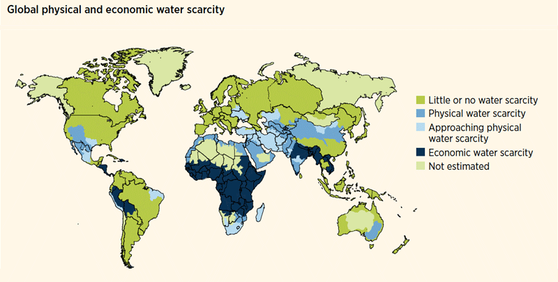
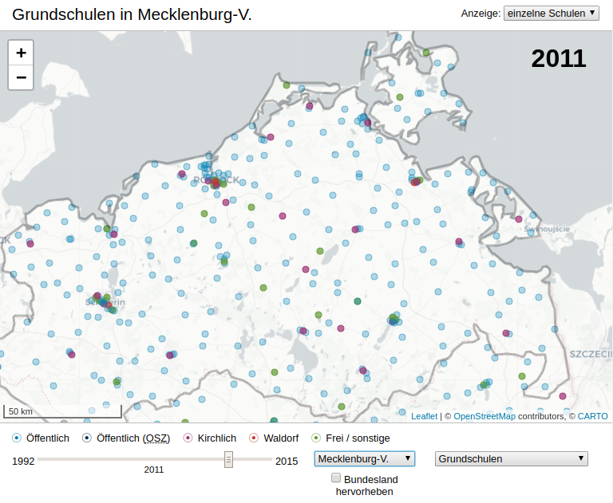

```{r, include=FALSE}
knitr::opts_chunk$set(R.options = list(max.print = 50))
set.seed(10042019)

library(sf)
library(maps)
library(ggplot2)
```

# A short introduction to data linkage with *dplyr*

TODO: handout only?

## Data linkage with *dplyr* {.smaller .build}

```{r, include=FALSE}
pm <- data.frame(city = c('Amman', 'Saltillo', 'Usak', 'The Bronx', 'Seoul'),
                 pm_mg = c(999, 869, 814, 284, 129),
                 stringsAsFactors = FALSE)
city_coords <- data.frame(city = c('Amman', 'Saltillo', 'Berlin', 'Usak', 'New York', 'Seoul'),
                          lng = c(31.910341, 1, 1, 1, 1, 1),
                          lat = c(35.948458, 1, 1, 1, 1, 1),
                          stringsAsFactors = FALSE)
```

Two datasets:

```{r, echo=FALSE}
knitr::kable(pm, caption = 'Particular matter: "pm" dataset', align = 'l', format = "html", table.attr = 'class="table table-condensed small left"')
```

```{r, echo=FALSE}
knitr::kable(city_coords, caption = 'GPS coordinates of cities: "city_coords" dataset', align = 'l', format = "html", table.attr = 'class="table table-condensed small"')
```

<div style="clear:both"><br></div>

- to combine these datasets, the "city" column might be used as identifier for matching
- not all cities in "pm" also appear in "city_coords" and vice versa


## Join operations {.smaller .build}

```{r, echo=FALSE}
knitr::kable(pm, caption = 'pm', align = 'l', format = "html", table.attr = 'class="table table-condensed small left"')
```

```{r, echo=FALSE}
knitr::kable(city_coords, caption = 'city_coords', align = 'l', format = "html", table.attr = 'class="table table-condensed small"')
```

<div style="clear:both"></div>

<br>Datasets can also be joined with `merge`, but I find *dplyr* easier to use.

`left_join(a, b, by = <criterion>)`: **always retains rows on the "left side"** and fills up non-matching rows with *NA*s.

```{r, warning=FALSE, message=FALSE}
library(dplyr)
left_join(pm, city_coords, by = 'city')
```

## Join operations {.smaller .build}

```{r, echo=FALSE}
knitr::kable(pm, caption = 'pm', align = 'l', format = "html", table.attr = 'class="table table-condensed small left"')
```

```{r, echo=FALSE}
knitr::kable(city_coords, caption = 'city_coords', align = 'l', format = "html", table.attr = 'class="table table-condensed small"')
```

<div style="clear:both"></div>

<br>`right_join(a, b, by = <criterion>)`: **always retains rows on the "right side"** and fills up non-matching rows with *NA*s. **How many rows do you expect for a right join between `pm` and `city_coords`? How many of them will contain an *NA* value?**

```{r}
right_join(pm, city_coords, by = 'city')
```


## Join operations {.smaller .build}

```{r, echo=FALSE}
knitr::kable(pm, caption = 'pm', align = 'l', format = "html", table.attr = 'class="table table-condensed small left"')
```

```{r, echo=FALSE}
knitr::kable(city_coords, caption = 'city_coords', align = 'l', format = "html", table.attr = 'class="table table-condensed small"')
```

<div style="clear:both"></div>

<br>`inner_join(a, b, by = <criterion>)`: **only retains rows that match on both sides.**

How many rows do you expect for an inner join between `pm` and `city_coords`?

```{r}
inner_join(pm, city_coords, by = 'city')
```

# Combining data and making a *choropleth map*

## What is a *choropleth map*? {.smaller .build}

In a *choropleth map*, regions are shaded according to the measurement of some variable, e.g.:

<div class="fullfig">
  <br>
  <small>source: [United Nations, "Water for life action"](https://www.un.org/waterforlifedecade/scarcity.shtml)</small>
</div>


## Making a choropleth map {.smaller .build}

- data downloaded from the Berlin Senate Dept. for Urban Dev. and Housing via [FIS Broker](https://fbinter.stadt-berlin.de/fb/index.jsp)
- includes indicators for monitoring of social development (*"Monitoring Soziale Stadtentwicklung 2017"*):

```{r}
bln_sozind <- read_sf('excercises/data/bln_plr_sozind.geojson')
head(bln_sozind)
```

## Making a choropleth map {.smaller}

```{r, echo=FALSE}
head(bln_sozind[c('PLANNAME', 'STATUS4', 'geometry')], 3)
```

- source: FIS Broker, *"Monitoring Soziale Stadtentwicklung 2017"*¹
- aim: visualize spatial distrib. of variable **`STATUS4` -- child poverty rate in percent²**
- dataset is already a **spatial dataset** containing geo-data in `geometry` column

<small>¹ Note that the FIS-Broker website is kind of awkward to use and you can't link directly to dataset, but you have to search for the mentioned keywords.</small><br>
<small>² Portion of children under 15 living in household that obtains social support ("Hartz IV")</small>


## Making a choropleth map {.smaller .build}

Directly plotting the map with fill color depending on `STATUS4`:

```{r, fig.height=3.5, fig.align='center'}
ggplot() + geom_sf(aes(fill = STATUS4), data = bln_sozind)
```

Problem: `STATUS4` is continuous and so is the color scale. For choropleth maps, discrete ranges are better for discerning the colors.


## Making a choropleth map {.smaller .build}

Put the percentages into 5 discrete bins, change the color palette, adjust the appearance:

```{r, fig.height=3.5, fig.align='center'}
bln_sozind$child_pov_bins <- cut(bln_sozind$STATUS4, seq(0, 100, by = 20))
ggplot() + geom_sf(aes(fill = child_pov_bins), data = bln_sozind) +
    scale_fill_brewer(palette = 'OrRd', na.value = "grey90",
                      guide = guide_legend(title = 'Child pov.\nranges in pct.')) +
    coord_sf(datum = NA) +  # disable lines ("graticules") in the background
    theme_bw() + theme(axis.text = element_blank(), axis.title = element_blank(),
                       axis.ticks = element_blank())
```

## Combining data {.smaller .build}

Most of the time, you have at least two datasets: one containing the measurement(s) you want to show, the other containing the geo-data.

Example dataset: [People at risk of poverty or social exclusion by NUTS 2 regions (*tgs00107*)](https://ec.europa.eu/eurostat/web/regions/data/main-tables) from Eurostat.

```{r}
pov_risk <- read.csv('excercises/data/tgs00107_pov_risk_nuts2.csv',
                     stringsAsFactors = FALSE)
pov_risk$risk_pct_bins <- cut(pov_risk$risk_pct, seq(0, 100, by = 10))

pov_risk_2016 <- filter(pov_risk, year == 2016)   # 2016 has fewest NAs
head(pov_risk_2016)
```

## Combining data {.smaller .build}

We load the [GeoJSON dataset for NUTS level-2 regions provided by Eurostat](https://github.com/eurostat/Nuts2json):

```{r, warning=FALSE, message=FALSE}
nutsrg2 <- read_sf('excercises/data/nutsrg_2.json')
st_crs(nutsrg2) <- 3857  # set the correct CRS
head(nutsrg2)
```

## Combining data {.smaller .build}

Both datasets contain a NUTS level-2 identifier so we can join them:

```{r}
pov_risk_2016_geo <- left_join(nutsrg2, pov_risk_2016, by = c('id' = 'nuts'))
head(pov_risk_2016_geo)
```

## Plotting the combined data {.smaller .build}

```{r, warning=FALSE, message=FALSE, fig.height=3.5, fig.align='center'}
(eu_pov_plt <- ggplot() + geom_sf(aes(fill = risk_pct_bins),
                                  data = pov_risk_2016_geo, size = 0.1) +
    scale_fill_brewer(palette = 'OrRd', na.value = "grey90",
                      guide = guide_legend(title = 'Pct. of people at\nrisk of poverty')) +
    labs(title = 'Poverty in the EU 2016',
         subtitle = 'Percentage of people at risk of poverty or social exclusion',
         caption = 'source: Eurostat') +
    coord_sf(datum = NA) +  # disable lines ("graticules") in the background
    theme_bw() + theme(axis.text = element_blank(), axis.title = element_blank(),
                       axis.ticks = element_blank()))
```

## Plotting the combined data

```{r, echo=FALSE, warning=FALSE, fig.align='center'}
eu_pov_plt
```


## Visualizing spatio-temporal data

If you also have a time-dimension in your data that you want to show, there are several options:

- using *small multiples* via ggplot facetting
- using animations via `gganimate`
- making an interactive map (e.g. with a "time slider")

## Visualizing spatio-temporal data {.smaller}

*Small multiples:* Dataset with time-related variable; plotted with facets (e.g. `facet_wrap()`)

```{r, echo=FALSE, warning=FALSE, message=FALSE, fig.height=5}
# 1. assign each year in the poverty data the corresponding year of the map
pov_risk_10_to_16 <- filter(pov_risk, year %in% seq(2010, 2016, by = 2))
pov_risk_10_to_16 <- mutate(pov_risk_10_to_16, map_year = case_when(year < 2013 ~ 2010L,
                                                                    year == 2014 ~ 2013L,
                                                                    year > 2014 ~ 2016L))

# 2. load geo-data for each available year (2010, 2013 and 2016)
map_yrs <- unique(pov_risk_10_to_16$map_year)
nutsrg2_per_yr <- list()
i <- 1
for (yr in map_yrs) {
    nutsrg2_per_yr[[i]] <- read_sf(sprintf('excercises/data/nutsrg_2_%d_epsg3857_20M.json', yr))
    nutsrg2_per_yr[[i]]$map_year <- yr
    st_crs(nutsrg2_per_yr[[i]]) <- 3857  # set the correct CRS
    i <- i + 1
}

# generate a single data frame with each year's geo-data
nutsrg2_all_yrs <- do.call(rbind, nutsrg2_per_yr)

# join geo-data and poverty data also on year level
pov_risk_10_to_16_geo <- left_join(nutsrg2_all_yrs, pov_risk_10_to_16, by = c('id' = 'nuts', 'map_year'))

# repeat missing geo-data for each year and set the respective year
yr10_na <- filter(pov_risk_10_to_16_geo,  map_year == 2010L & is.na(year))
yr10_na$year <- 2010
pov_risk_10_to_16_geo <- rbind(pov_risk_10_to_16_geo, yr10_na)
yr10_na$year <- 2012
pov_risk_10_to_16_geo <- rbind(pov_risk_10_to_16_geo, yr10_na)
yr13_na <- filter(pov_risk_10_to_16_geo,  map_year == 2013L & is.na(year))
yr13_na$year <- 2014
pov_risk_10_to_16_geo <- rbind(pov_risk_10_to_16_geo, yr13_na)
yr16_na <- filter(pov_risk_10_to_16_geo,  map_year == 2016L & is.na(year))
yr16_na$year <- 2016
pov_risk_10_to_16_geo <- rbind(pov_risk_10_to_16_geo, yr16_na)

# drop the rows with the missing geo-data
pov_risk_10_to_16_geo <- filter(pov_risk_10_to_16_geo, !is.na(year))

# 3. make the map using facets
ggplot() + geom_sf(aes(fill = risk_pct_bins), data = pov_risk_10_to_16_geo, size = 0.1) +
    scale_fill_brewer(palette = 'OrRd', na.value = "grey90",
                      guide = guide_legend(title = 'Pct. of people at\nrisk of poverty')) +
    labs(title = 'Poverty in southern EU 2016 (NUTS level-2)',
         subtitle = 'Percentage of people at risk of poverty or social exclusion',
         caption = 'source: Eurostat') +
    coord_sf(datum = NA, xlim = c(-12e5, 35e5), ylim = c(41e5, 68e5)) +
    facet_wrap(~ year, nrow = 2) +   # facets per year
    theme_bw() + theme(axis.text = element_blank(), axis.title = element_blank(),
                       axis.ticks = element_blank(), legend.position = 'bottom')
```

## Visualizing spatio-temporal data {.smaller}

Animations: Use `gganimate` for time-lapse plot animations.

<div style="width: 80%">
```{r, echo=FALSE, warning=FALSE, message=FALSE, fig.width=3.5, fig.height=2.5, align='center'}
library(gganimate)

ggplot() + geom_sf(aes(fill = risk_pct_bins), data = pov_risk_10_to_16_geo, size = 0.1) +
    scale_fill_brewer(palette = 'OrRd', na.value = "grey90",
                      guide = 'none') +
    coord_sf(datum = NA, xlim = c(-12e5, 35e5), ylim = c(41e5, 68e5)) +
    theme_bw() + theme(axis.text = element_blank(), axis.title = element_blank(),
                       axis.ticks = element_blank(), legend.position = 'bottom',
                       title = element_text(size = 7),
                       legend.text = element_text(size = 5)) +
    labs(title = 'Poverty in southern EU {current_frame} (NUTS level-2)',
         subtitle = 'Percentage of people at risk of poverty or social exclusion',
         caption = 'source: Eurostat') +
    transition_manual(year)
```
</div>

## Visualizing spatio-temporal data {.smaller}

- interactive plots (e.g. with a "time-slider") are harder to do
- interactive maps can be made in R with [Shiny](http://shiny.rstudio.com/)
- more sophisticated maps may require lots of manual programming

<div class="fullfig">
  <br>
  <small>[Helbig, Konrad, Nikolai 2018 / https://schulenkarte.wzb.eu](https://schulenkarte.wzb.eu)</small>
</div>


# Geographic coordinate systems and projections

## Vector data

## Coordinate reference systems and units


## Projections

## TODO

- coord_sf / st_crop

- labels:
- st_centroid
- col_bind

## Further reading

- sf vignette
- https://cran.r-project.org/web/views/Spatial.html
- https://geocompr.robinlovelace.net/
- ggplot2

