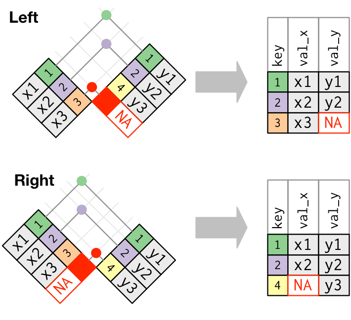

# Data linkage with *dplyr*

## Left and right (outer) joins

*Left and right outer joins* keep all observations on the left-hand or right-hand side data sets respectively. Unmatched rows are filled up with *NA*s:

Syntax: `inner_join(a, b, by = <criterion>)`

## Inner joins

An *inner join* matches keys that appear in both data sets and returns the combined observations:

Syntax: `inner_join(a, b, by = <criterion>)`

## Specifying matching criteria

Parameter `by` can be:

1. a character string specifying the key for both sides, e.g.: `inner_join(pm, city_coords, by = 'city')` will match `city` column in `pm` with `city` column in `city_coords`;
2. a vector of character strings specifying several keys to match both sides, e.g.: `inner_join(pm, city_coords, by = c('city', 'country')` will match those rows, where `city` *and* `country` columns match;
3. a *named* character string vector like `inner_join(pm, city_coords, by = c('cityname' = 'id')`, which will match the column `cityname` in `pm` with the column `id` in `city_coords`

## An example

TODO

# Plotting with *ggplot2*

TODO

