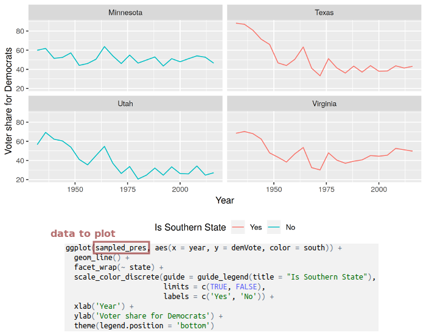
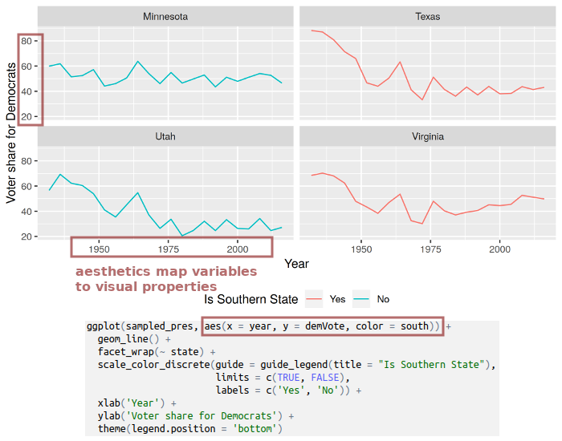
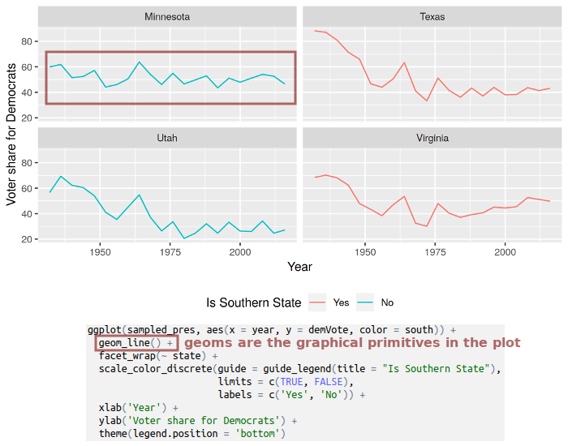
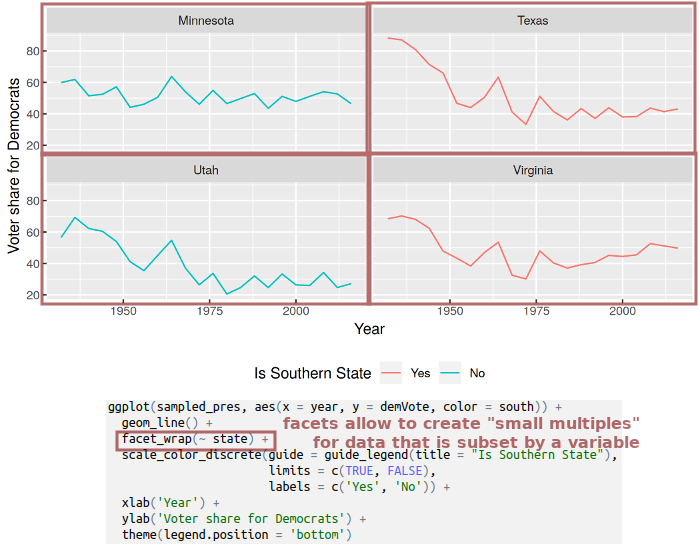
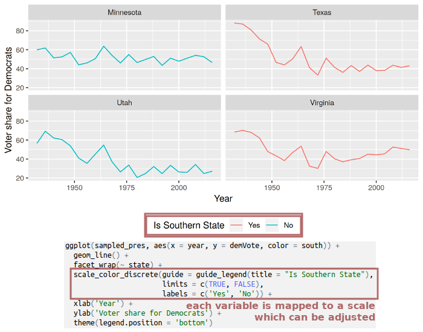
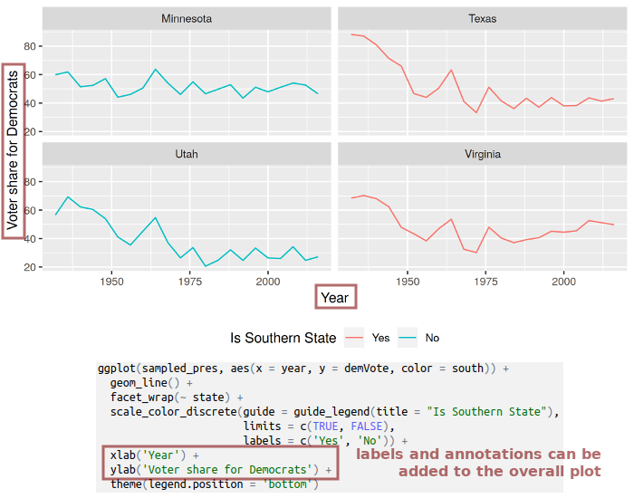
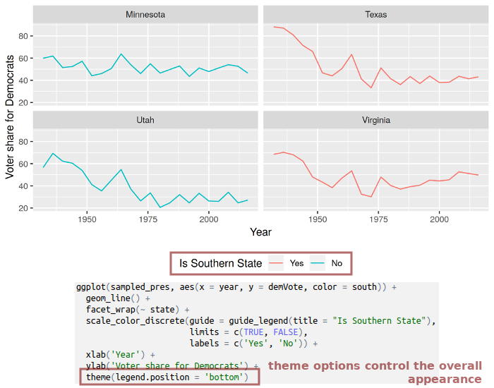

```{r, include=FALSE}
knitr::opts_chunk$set(R.options = list(max.print = 50))
```

## Today's schedule

TODO: nachträglich anpassen

1. Introduction
2. A short primer on data linkage with *dplyr* and plotting with *ggplot2*
3. Hello world: Plotting points on a world map
4. Sources and file formats for geographic data

-- lunch break --

5. Combining data and making a *choropleth map*
6. Geo-coding and reverse geo-coding via Google Maps API
7. Geographic coordinate systems and projections


# Introduction

## About me

TODO

## Aims of today's workshop

TODO

# A short primer on data linkage with *dplyr* and plotting with *ggplot2*

## Data linkage with *dplyr* {.smaller .build}

```{r, include=FALSE}
pm <- data.frame(city = c('Amman', 'Saltillo', 'Usak', 'The Bronx', 'Seoul'),
                 pm_mg = c(999, 869, 814, 284, 129),
                 stringsAsFactors = FALSE)
city_coords <- data.frame(city = c('Amman', 'Saltillo', 'Berlin', 'Usak', 'New York', 'Seoul'),
                          lng = c(31.910341, 1, 1, 1, 1, 1),
                          lat = c(35.948458, 1, 1, 1, 1, 1),
                          stringsAsFactors = FALSE)
```

Two datasets:

```{r, echo=FALSE}
knitr::kable(pm, caption = 'Particular matter: "pm" dataset', align = 'l', format = "html", table.attr = 'class="table table-condensed small left"')
```

```{r, echo=FALSE}
knitr::kable(city_coords, caption = 'GPS coordinates of cities: "city_coords" dataset', align = 'l', format = "html", table.attr = 'class="table table-condensed small"')
```

<div style="clear:both"><br></div>

- to combine these datasets, the "city" column might be used as identifier for matching
- not all cities in "pm" also appear in "city_coords" and vice versa


## Join operations {.smaller .build}

```{r, echo=FALSE}
knitr::kable(pm, caption = 'pm', align = 'l', format = "html", table.attr = 'class="table table-condensed small left"')
```

```{r, echo=FALSE}
knitr::kable(city_coords, caption = 'city_coords', align = 'l', format = "html", table.attr = 'class="table table-condensed small"')
```

<div style="clear:both"></div>

<br>Datasets can also be joined with `merge`, but I find *dplyr* easier to use.

`left_join(a, b, by = <criterion>)`: **always retains rows on the "left side"** and fills up non-matching rows with *NA*s.

```{r, warning=FALSE, message=FALSE}
library(dplyr)
left_join(pm, city_coords, by = 'city')
```

## Join operations {.smaller .build}

```{r, echo=FALSE}
knitr::kable(pm, caption = 'pm', align = 'l', format = "html", table.attr = 'class="table table-condensed small left"')
```

```{r, echo=FALSE}
knitr::kable(city_coords, caption = 'city_coords', align = 'l', format = "html", table.attr = 'class="table table-condensed small"')
```

<div style="clear:both"></div>

<br>`right_join(a, b, by = <criterion>)`: **always retains rows on the "right side"** and fills up non-matching rows with *NA*s. **How many rows do you expect for a right join between `pm` and `city_coords`? How many of them will contain an *NA* value?**

```{r}
right_join(pm, city_coords, by = 'city')
```


## Join operations {.smaller .build}

```{r, echo=FALSE}
knitr::kable(pm, caption = 'pm', align = 'l', format = "html", table.attr = 'class="table table-condensed small left"')
```

```{r, echo=FALSE}
knitr::kable(city_coords, caption = 'city_coords', align = 'l', format = "html", table.attr = 'class="table table-condensed small"')
```

<div style="clear:both"></div>

<br>`inner_join(a, b, by = <criterion>)`: **only retains rows that match on both sides.**

How many rows do you expect for an inner join between `pm` and `city_coords`?

```{r}
inner_join(pm, city_coords, by = 'city')
```

## Plotting with *ggplot2* {.build .smaller}

There are three basic steps for constructing plots with *ggplot2*:

1. Supply a data set you want to plot to `ggplot()`.
2. Define an **aesthetic mapping** with `aes()`.<br>
    This describes how variables of your data are mapped to visual properties, e.g. variable "age" is plotted on the x-axis and "income" on the y-axis.
3. Add layers of **geoms** (geometrical objects) that describe which graphical primitives to use (e.g. points in a scatter plot or bars in a bar plot).

Additionally, you can further change the appearance of your plot by: 

- altering the **scales** (e.g. use a logarithmic scale, modify display of factors, etc.)
- defining **facets** &rarr; create *small multiples*, each showing a different subset of the data
- changing the overall appearance of the plot by adjusting its **theme** (e.g. change background color, rotate axis labels, etc.)

You combine all these steps with a `+`.

## General concepts behind *ggplot2*



## General concepts behind *ggplot2*



## General concepts behind *ggplot2*



## General concepts behind *ggplot2*



## General concepts behind *ggplot2*



## General concepts behind *ggplot2*



## General concepts behind *ggplot2*



# Hello world: Plotting points on a world map

## Packages, packages, packages {.build}

We need to extend R in order to work with geographic data in R by installing these packages:

- *maps*: contains geographic data for national borders and administrative regions for several countries
- *rgeos* and *maptools*: Misc. functions for operations on geometries
- *sf*: *"Simple Features for R"* -- reading, writing and transforming spatial data

Install them if you haven't yet:

```{r, eval=FALSE}
install.packages(c('maps', 'maptools', 'sf', 'rgeos'))
```

## Simple features

*Simple features* (as implemented in the package `sf`)


## Making a world map {.build .smaller}

First, we load the packages that we need:

```{r, warning=FALSE, message=FALSE}
library(ggplot2)
library(maps)
library(sf)
```

The function `map` can be used to load the "world" data. We need to convert it to a "simple features" object via `st_as_sf()`:

```{r}
worldmap_data <- st_as_sf(map('world', plot = FALSE, fill = TRUE))
head(worldmap_data, n = 3)  # to have a look inside
```

## Making a world map {.smaller}

We are ready to plot the world map. Every "simple features" object can be plotted by adding a `geom_sf` layer:

```{r, fig.width=8}
ggplot() + geom_sf(data = worldmap_data)
```

## Putting points on the map {.smaller .build}

We have some cities along with their GPS longitude (`lng`) and latitude (`lat`):

```{r, echo=FALSE}
some_cities <- data.frame(name = c('Berlin', 'New York', 'Sydney'),
                          lng = c(13.38, -73.94, 151.21),
                          lat = c(52.52, 40.6, -33.87))
some_cities
```

We add a "point geom" layer to our map:

```{r, fig.width=6, fig.height=3, fig.align='center'}
ggplot(some_cities) +                                # pass the cities data to plot
    geom_sf(data = worldmap_data) +                  # layer 1: world countries
    geom_point(aes(x = lng, y = lat), color = 'red') # layer 2: points at city coord.
```


## Adding labels next to the points {.smaller}

You may also add text labels for the cities. *ggplot2* provides `geom_text` and `geom_label` (draws box around text):

```{r, fig.width=6, fig.height=3, fig.align='center'}
ggplot(some_cities) +                                  # pass the cities data to plot
    geom_sf(data = worldmap_data) +                    # layer 1: world countries
    geom_point(aes(x = lng, y = lat), color = 'red') + # layer 2: points
    geom_label(aes(x = lng, y = lat, label = name),    # layer 3: labels
               hjust = 0, vjust = 1, nudge_x = 3) +    # labels appear next to point
    theme(axis.title = element_blank())                # disable the axis labels
```


## sources

- R packages (*maps*)

